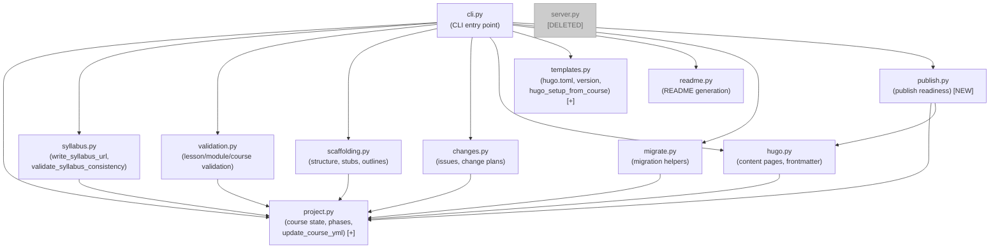
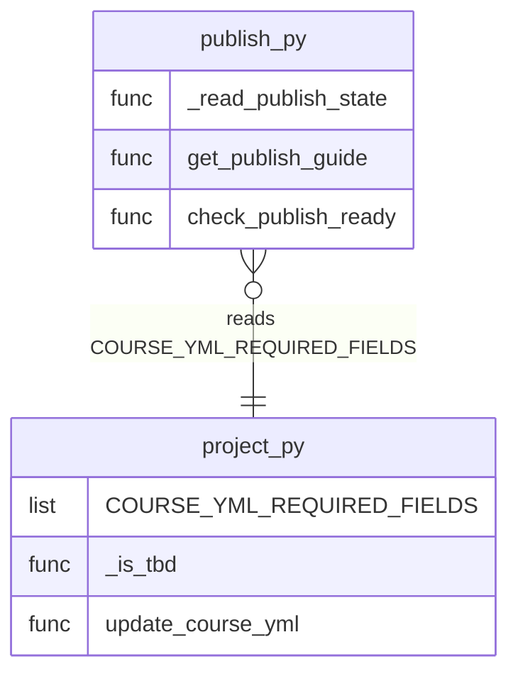

# Architecture Update — Sprint 002: Replace MCP Server with CLI

## What Changed

### New Module: curik/publish.py

A new domain module that owns all publish-readiness logic. It is extracted
from server.py, where it lived as inline tool handler code.

**Responsibility**: Read course state and determine publish readiness.
**Boundary**: Inside — `_read_publish_state`, `get_publish_guide`,
`check_publish_ready`. Outside — YAML I/O (delegated to yaml library),
Hugo build invocation (delegated to hugo.py).
**Use cases served**: SUC-004, SUC-005

### Module Modified: curik/project.py

Two additions extracted from server.py:

- `COURSE_YML_REQUIRED_FIELDS` — list of field names required before publishing
- `_is_tbd(value)` — predicate that returns True if a course.yml value is
  unset or placeholder
- `update_course_yml(root, updates)` — YAML merge function that writes back
  course.yml and reports which required fields remain TBD

**Responsibility boundary unchanged**: project.py owns course state, phase
management, and course.yml I/O. These additions fit naturally inside that
boundary.

**Use cases served**: SUC-003, SUC-005

### Module Modified: curik/templates.py

One addition:

- `hugo_setup_from_course(root)` — reads title, tier, repo_url from course.yml
  then calls the existing `hugo_setup(root, title, tier, repo_url=repo_url)`

This extracts the course.yml reading that lived in `tool_hugo_setup` in
server.py, making it callable from the CLI without reimplementing the read.

**Use cases served**: SUC-005

### Module Rewritten: curik/cli.py

Complete rewrite from 98 lines to ~900 lines. The new cli.py:

- Defines 14 top-level command groups using argparse subparsers
- Each group has its own subparser with further subcommands
- A shared `_json_input(args)` helper resolves JSON from positional arg,
  `--file`/`-f`, or stdin (in that precedence order)
- Every subcommand accepts `--path` (default `.`) and resolves to an absolute
  Path before calling domain functions
- Appropriate subcommands accept `--json` to print machine-parseable JSON
- Each handler is a thin wrapper: parse args, call domain function, print result

**Responsibility**: CLI entry point — argument parsing and output formatting only.
**Boundary**: cli.py calls domain modules. It does not contain business logic.
**Use cases served**: SUC-001, SUC-002, SUC-003, SUC-004, SUC-007

### Module Modified: curik/init_command.py

Three removals and one change:

- Remove `MCP_CONFIG` constant
- Remove `VSCODE_MCP_CONFIG` constant
- Remove `_update_vscode_mcp_json()` function and its call in `run_init()`
- Change `_update_settings_json()`: permission string changes from
  `"mcp__curik__*"` to `"Bash(curik *)"`

`run_init()` no longer writes .vscode/mcp.json.

**Use cases served**: SUC-002

### Module Modified: curik/project.py — init_course()

`init_course()` stops writing a curik entry to .mcp.json. The .mcp.json
block that wrote `{"mcpServers": {"curik": ...}}` is removed. If .mcp.json
does not exist, it is not created. If it exists, it is not touched.

**Use cases served**: SUC-002

### Module Modified: curik/init/claude-section.md

Rewritten to describe CLI commands instead of MCP tools. The `## Before You
Do Anything` and `## Rules` sections change to reference `curik status` and
`curik phase get` instead of `get_course_status()` and `get_phase()`. The
`## Available MCP Tools` section is replaced with a `## Available Commands`
section listing CLI subcommand groups.

**Use cases served**: SUC-002

### Module Modified: curik/init/curik-skill.md

Rewritten to invoke CLI commands. The `/curik <command>` dispatch table
maps to `Bash(curik <group> <subcommand>)` calls instead of MCP tool calls.

**Use cases served**: SUC-002

### Module Deleted: curik/server.py

The entire MCP server is removed after the CLI is built and tested.

**Use cases served**: SUC-006

### Dependency Removed: mcp>=1.0

Removed from pyproject.toml. No curik module imports from mcp after server.py
is deleted.

**Use cases served**: SUC-006

### Config Updated: .mcp.json

The curik entry is removed. The clasi entry is retained.

**Use cases served**: SUC-006

---

## Module Diagram

The diagram shows the curik package after this sprint. cli.py replaces
server.py as the entry point. publish.py is new. server.py is deleted.

## Entity-Relationship: course.yml required fields ownership

## Why

The curik package is migrating from MCP server to CLI. Sprint 001 pruned
unused modules. This sprint completes the migration:

- **server.py inline logic** — `tool_update_course_yml`, `tool_hugo_setup`,
  and the publish trio contain real business logic that belongs in domain
  modules. Putting it there makes it testable in isolation and callable from
  the CLI without duplicating it.
- **CLI over MCP** — Claude Code can invoke the CLI via its Bash tool without
  a running server, without .mcp.json registration, and without the MCP
  protocol overhead. The CLI is simpler to test, simpler to distribute, and
  simpler to explain to agents.
- **publish.py as separate module** — publish readiness logic touches course
  state, Hugo state, and filesystem state. It is cohesive on its own and does
  not belong in project.py (which already has a clear boundary around course
  phase management).

## Impact on Existing Components

**curik/server.py** — Deleted. Any test or code that imports from
`curik.server` will break. test_mcp_server.py must be migrated or deleted.

**curik/cli.py** — Completely rewritten. Old CLI subcommands (init, get-phase,
get-spec, update-spec, advance-phase, mcp) are superseded by the new grouped
command tree. The `curik mcp` subcommand is removed.

**curik/init_command.py** — `run_init()` signature and return value are
unchanged. Internal behavior changes: no .vscode/mcp.json write, different
permission string in settings.local.json.

**curik/project.py** — `init_course()` no longer writes .mcp.json. Projects
that were initialized with the old version will retain their existing .mcp.json
curik entry until someone runs `curik init` again or removes it manually.

**tests/test_mcp_server.py** — This file tests tool handler functions on
`curik.server`. After server.py is deleted, this file is deleted or fully
replaced. Surviving coverage of the same logic moves to test_cli.py and
unit tests of the new domain functions.

**tests/test_cli.py** — The two existing tests still pass (init command
behavior is preserved). The file grows to cover all 14 command groups.

**tests/test_init_command.py** — Assertions about `mcp__curik__*` permission
and .vscode/mcp.json creation must be updated to match the new behavior.

## Design Rationale

### Decision: Extract business logic before building CLI

**Context**: The CLI needs to call domain functions, not reimplement logic.
server.py contains four pockets of inline logic that must move to domain
modules first.

**Alternatives considered**:
1. Build CLI first, duplicate logic, then clean up — creates two places to
   update during testing.
2. Extract and build in the same ticket — harder to review, harder to test
   extraction in isolation.
3. Extract first (ticket 001), then build CLI (ticket 002) — clear dependency,
   each step independently testable.

**Why this choice**: Option 3. The extraction ticket is small and easily
reviewed. The CLI ticket can be written assuming the domain functions exist.

**Consequences**: ticket 002 depends on ticket 001. No other ticket sequencing
constraints arise from this decision.

### Decision: Single cli.py file, not a cli/ package

**Context**: The new CLI is ~900 lines. Some options: keep it one file,
split into cli/groups/phase.py, cli/groups/hugo.py, etc., or use a CLI
framework like Click.

**Alternatives considered**:
1. cli/ package with one file per group (~14 files) — more discoverable
   but requires __init__.py wiring and import management.
2. Single cli.py — mirrors server.py's role as thin wrapper, simpler to
   navigate, consistent with the existing codebase style.
3. Click or Typer — adds a dependency; stakeholder agreed to keep argparse.

**Why this choice**: Option 2. cli.py is a dispatch layer, not a business
logic module. 900 lines of argparse boilerplate is acceptable; it reads
linearly. The grouping within the file (one block per command group) provides
adequate structure without package complexity.

**Consequences**: cli.py will be the longest file in the codebase. This is
acceptable given its mechanical nature.

### Decision: New publish.py module rather than expanding project.py

**Context**: The three publish functions (`_read_publish_state`,
`get_publish_guide`, `check_publish_ready`) could go into project.py or into
a new publish.py.

**Alternatives considered**:
1. Into project.py — simpler, but project.py already has a clear boundary
   (course state and phase management). Adding publish readiness to it
   violates cohesion: project.py would change for two reasons.
2. Into hugo.py — publish readiness touches Hugo config but also course.yml,
   workflows, and content. Hugo.py owns content page operations; publish
   readiness is a different concern.
3. New publish.py — single responsibility, natural name, easy to find.

**Why this choice**: Option 3. Publish readiness is a cross-cutting check
(course.yml + Hugo + git + workflow), not a natural extension of any existing
module.

**Consequences**: publish.py depends on project.py and hugo.py. This is
acceptable and follows the existing dependency direction.

### Decision: JSON input via positional arg, --file, or stdin

**Context**: Some CLI subcommands need structured JSON input (e.g.,
scaffold structure JSON, change plan items). Three delivery mechanisms are
useful to Claude Code: inline positional arg (for simple cases), `--file`/`-f`
(for pre-written files), and stdin (for piped output from other commands).

**Alternatives considered**:
1. Only positional arg — harder for large JSON blobs; shell quoting issues.
2. Only --file — requires writing a temp file, more steps for Claude.
3. All three with clear precedence (positional → file → stdin) — flexible,
   matches common Unix tool conventions.

**Why this choice**: Option 3. Claude Code generates JSON inline in simple
cases. A file input path is useful when the agent has written JSON to a file
as part of another step. Stdin supports composition.

**Consequences**: The `_json_input(args)` helper must handle all three cases
and raise a clear error if none provides valid JSON.

## Open Questions

None. Design decisions are agreed with the stakeholder. The command tree
is fully specified. The extraction targets in server.py are clearly identified.

## Migration Concerns

**Existing curriculum projects** — Projects initialized with older curik
versions have .mcp.json with a curik entry and `mcp__curik__*` in
.claude/settings.local.json. These continue to work until the curik MCP server
is uninstalled (server.py no longer exists in the new package). Agents working
in those projects will encounter "server not found" errors when they try to use
MCP tools. They must re-run `curik init` to migrate to the CLI model.

**curik package consumers** — Any script or agent that imports from
`curik.server` will break when server.py is deleted. There are no known
external consumers; this is an internal package.

**test_mcp_server.py** — Must be replaced or deleted in this sprint. It will
fail to import after server.py is deleted.

**No data migration required** — All domain data (.course/, course.yml, content/)
is unchanged. The migration is purely at the protocol layer.
