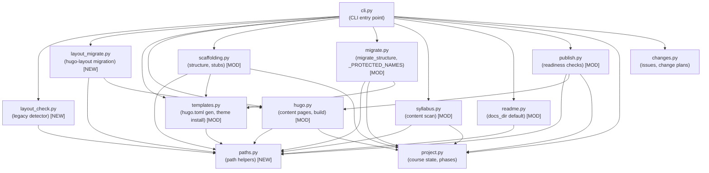

# Architecture Update — Sprint 003: Sequester Hugo into site/ Subdirectory

## What Changed

### New Module: curik/paths.py

A new pure-utility module that owns all path-construction logic for the
`site/` subdirectory layout.

**Responsibility**: Compute absolute paths to Hugo-related locations given a
project root. Returns `Path` objects; makes no filesystem calls.
**Boundary**: Inside — `SITE_DIR` constant and five path helpers (`site_root`,
`hugo_toml_path`, `content_dir`, `themes_dir`, `theme_dir`). Outside — filesystem
I/O, Hugo invocation, course.yml reading.
**Use cases served**: SUC-001, SUC-002, SUC-003, SUC-004

No other curik module is imported from `paths.py`. All other modules import from
it.

### New Module: curik/layout_check.py

A detector that reports whether a project is using the legacy Hugo layout.

**Responsibility**: Inspect the project root and return a warning message when
Hugo files are present at root but absent from `site/`.
**Boundary**: Inside — `check_legacy_hugo_layout(root) -> str | None`. Outside —
path construction (delegates to `paths.py`), any mutations.
**Use cases served**: SUC-002

Detection rule: any of `root/hugo.toml`, `root/themes/curriculum-hugo-theme/`,
or `root/content/_index.md` exists AND `root/site/hugo.toml` does NOT exist.

### New Module: curik/layout_migrate.py

Implements the one-shot opt-in migration from the legacy root layout to the
`site/` layout.

**Responsibility**: Move Hugo files from root to `site/` using `git mv`, rewrite
`site/hugo.toml` mounts, and rewrite the `.gitignore` CURIK block.
**Boundary**: Inside — `migrate_hugo_layout(root, *, dry_run, force, verify) -> dict`.
Outside — path construction (delegates to `paths.py`), Hugo build invocation
(delegates to `hugo.py` via subprocess for `--verify`).
**Use cases served**: SUC-002

### Module Modified: curik/templates.py

Two changes:

- `get_hugo_config()` — the `course.yml` mount changes from
  `source = "course.yml"` to `source = "../course.yml"` because `hugo.toml` now
  lives at `site/hugo.toml`, one level below the project root.
- `hugo_setup()` — `hugo_toml` target path changes from `root / "hugo.toml"` to
  `hugo_toml_path(root)` (= `root / "site" / "hugo.toml"`); theme destination
  changes from `root / "themes" / THEME_NAME` to `theme_dir(root)` (=
  `root / "site" / "themes" / THEME_NAME`).
- `bump_curriculum_version()` — resolves `hugo.toml` via `hugo_toml_path(root)`.
- `hugo_setup_from_course()` — unchanged call signature; delegates to updated
  `hugo_setup`.

**Use cases served**: SUC-001

### Module Modified: curik/hugo.py

Three changes:

- `hugo_build()` — `cwd` changes from `str(root)` to `str(site_root(root))`.
- `list_content_pages()` — `content_dir` changes from `root / "content"` to
  `content_dir(root)` (= `root / "site" / "content"`). Returned `path` values
  are still relative to the `content_dir`, not to `root`, preserving the public
  API.
- `create_content_page()` and `update_frontmatter()` — resolve paths through
  `content_dir(root)`.

**Use cases served**: SUC-003, SUC-004

### Module Modified: curik/scaffolding.py

- `scaffold_structure()` — `content/` creation, module dirs, and lesson stubs all
  route through `content_dir(root)` instead of `root / "content"`. Hugo setup call
  is unchanged (delegates to `hugo_setup`, which is already updated).
- `create_lesson_stub()` — `mod_dir` resolves through `content_dir(root)`.

**Use cases served**: SUC-001

### Module Modified: curik/migrate.py

Three changes:

- `migrate_structure()` — `content_dir` resolved via `content_dir(root)` from
  `paths.py`; theme destination via `theme_dir(root)`; hugo.toml path via
  `hugo_toml_path(root)`.
- `_PROTECTED_NAMES` — adds `"site"` (never move the new `site/` dir when
  sequestering); removes `"hugo.toml"` and `"themes"` (they are no longer at root
  in new-layout projects).
- `inventory_course()` — Hugo generator detection checks both
  `root / "hugo.toml"` (legacy) and `hugo_toml_path(root)` (new layout).

**Use cases served**: SUC-002

### Module Modified: curik/syllabus.py

- `validate_syllabus_consistency()` — `docs_dir` changes from `root / "content"` to
  `content_dir(root)`.

**Use cases served**: SUC-001

### Module Modified: curik/readme.py

- `generate_readmes()` — `docs_dir` default parameter changes from `"content"` to
  `str(content_dir(root).relative_to(root))` at call time (i.e. `"site/content"`),
  so the default reflects the new layout without breaking callers that pass an
  explicit `docs_dir`.

**Use cases served**: SUC-001

### Module Modified: curik/publish.py

Five path references updated through helpers:

- `has_hugo_toml` — uses `hugo_toml_path(root).exists()`
- `has_theme` — uses `theme_dir(root)`
- `has_local_baseof` — uses `site_root(root) / "layouts" / "_default" / "baseof.html"`
- `content_dir` scan — uses `content_dir(root)`
- `base_url` read — reads from `hugo_toml_path(root)`

**Use cases served**: SUC-001, SUC-003

### Module Modified: curik/cli.py

Three changes:

1. Legacy-layout warning — near the top of `main()`, after `--path` is resolved,
   calls `check_legacy_hugo_layout(root)`. If it returns a non-None string, prints
   it to stderr. Suppressed when `CURIK_NO_LAYOUT_WARNING=1` is set or when
   `--quiet` is passed (if that flag exists).
2. `--docs-dir` default — changes from `"content"` to `"site/content"` in the
   `readme generate` subcommand parser.
3. New `migrate hugo-layout` subcommand — calls `migrate_hugo_layout()` from
   `layout_migrate.py`; accepts `--dry-run`, `--force`, `--verify` flags.

**Use cases served**: SUC-001, SUC-002, SUC-003, SUC-004

### Template Modified: curik/init/gitignore

CURIK block updated:

```
# Hugo build output (now under site/)
site/public/
site/resources/_gen/

# Hugo lock file
site/.hugo_build.lock
```

**Use cases served**: SUC-001

### Template Modified: curik/init/deploy-pages.yml

Build step changes from `run: hugo --minify` to
`run: hugo --minify --source site`. Upload artifact path changes from
`./public` to `./site/public`.

**Use cases served**: SUC-001

### Docs Updated: agent-facing files

- `curik/init/claude-section.md` — "Hugo Theme" section: theme path updated to
  `site/themes/curriculum-hugo-theme/`, hugo.toml reference updated to `site/hugo.toml`.
- `curik/references/hugo-conventions.md` — all root-relative Hugo path references
  updated with `site/` prefix.
- `curik/skills/repo-scaffolding.md` — scaffolded layout example updated.
- `curik/agents/start-curik.md` — paths table updated.

**Use cases served**: SUC-001, SUC-002

---

## Module Diagram



## Dependency Graph Change

`paths.py` is a new leaf dependency — nothing within curik imports it except
modules that consume paths. The dependency direction is correct:

```
cli.py → domain modules → paths.py
                        → project.py
                        → templates.py (infrastructure-ish)
```

No cycles introduced.

---

## Why

Curriculum project roots were polluted with Hugo build machinery (`hugo.toml`,
`themes/`, `content/`, `public/`, `resources/`). This made it hard for authors and
agents to distinguish curik's data files from the Hugo site files. Moving everything
Hugo into `site/` creates a clean boundary.

A single `paths.py` helper module ensures the `site/` constant is defined in exactly
one place. Without it, all eight affected modules would hardcode the string `"site"` or
`"site/content"`, and any future rename would require shotgun surgery across the
codebase.

The legacy-layout detector and `migrate hugo-layout` command are needed because there
are existing curriculum repos in the wild on the old layout. Auto-migration would be
destructive and irreversible without user consent. Detect-and-warn is safe; opt-in
migration is safe. Auto-migration is not.

---

## Impact on Existing Components

**curik/templates.py** — `hugo.toml` is written to a new location. Callers that read
`root / "hugo.toml"` directly (outside curik) will not find it. All internal callers
are updated.

**curik/hugo.py** — `hugo_build` cwd change is transparent to callers. Returned
`path` values from `list_content_pages` and `create_content_page` remain relative to
`content_dir`, so the public CLI surface is unchanged.

**curik/migrate.py** — `_PROTECTED_NAMES` change affects `sequester_content()`:
`"hugo.toml"` and `"themes"` are no longer protected at root (they are gone from
root in new-layout projects), and `"site"` is added to the protected set.

**curik/cli.py** — The `--docs-dir` default for `readme generate` changes from
`"content"` to `"site/content"`. Any caller that relied on the default without
passing `--path` to a new-layout project will now get the correct default
automatically.

**Existing curriculum projects** — Unaffected until `curik migrate hugo-layout` is
run. The legacy-layout warning fires on every `curik` invocation but does not block
execution.

---

## Migration Concerns

**Existing curriculum repos (the wild)** — Hugo files remain at root. `curik` still
works against these projects (domain functions that read `hugo.toml` or `content/`
will find nothing at the new paths, which may cause benign "not found" states). The
warning guides authors to run `curik migrate hugo-layout`.

**Tests** — All test fixtures that create a Hugo project layout must be updated to use
`site/` paths. Tests that assert on `root / "hugo.toml"` must assert on
`root / "site" / "hugo.toml"` instead.

**No data migration required** — `course.yml`, `.course/`, `.claude/`, and all curik
metadata files stay at root. Only Hugo files move.

---

## Design Rationale

### Decision: Separate paths.py module vs extending templates.py

**Context**: Path constants and helpers could go in `templates.py` (which already
owns the `THEME_NAME` constant and `hugo_setup`) or in a dedicated `paths.py`.

**Alternatives considered**:
1. Extend `templates.py` — keeps all Hugo-related constants in one file but
   `templates.py` already has a clear role (template generation). Adding path
   math changes it for two reasons.
2. New `paths.py` — single responsibility, no side effects, importable by any
   module without pulling in template generation logic.

**Why this choice**: Option 2. `paths.py` is a pure utility with no side effects.
Any module can import it without the transitive dependency on `subprocess`, `shutil`,
or `importlib` that `templates.py` carries. Cohesion test passes: `paths.py` changes
only when the directory layout changes.

**Consequences**: `templates.py` imports from `paths.py`. This is a stable-toward-
stable dependency.

### Decision: New layout_check.py and layout_migrate.py vs extending migrate.py

**Context**: The legacy-layout detection and migration logic could go in `migrate.py`,
which already owns migration helpers.

**Alternatives considered**:
1. Extend `migrate.py` — reduces file count but `migrate.py` already handles
   inventory and migrate_structure (different concerns: course structure migration,
   not Hugo-layout migration). Cohesion fails.
2. Separate modules — `layout_check.py` is read-only (detection only); it changes
   only when the detection rule changes. `layout_migrate.py` is write-heavy;
   it changes when the migration steps change. They change for different reasons.

**Why this choice**: Option 2. Separate modules pass the cohesion test. Each is
focused: `layout_check.py` answers "is this legacy?"; `layout_migrate.py` answers
"how do I fix it?".

**Consequences**: `cli.py` imports from two new modules. Fan-out increases to 13
imports, slightly above the 4-5 guideline. This is acceptable for a CLI entry point,
which is explicitly a dispatch layer.

### Decision: Public CLI surface unchanged (no site/ prefix in page-path args)

**Context**: `curik hugo create-page mod/intro.md "Intro"` could be changed to require
`site/content/mod/intro.md`, making the internal path explicit. Alternatively, the
helper prepends `site/content/` internally and the user sees only `mod/intro.md`.

**Alternatives considered**:
1. Expose `site/content/` prefix — no hidden magic, but breaks every existing script
   and agent prompt that calls `curik hugo create-page`.
2. Internal prepend — transparent to callers, backward-compatible.

**Why this choice**: Option 2. The user-facing path is a logical path within the
content tree, not a filesystem path. The `site/` subdirectory is an implementation
detail that agents and authors should not need to think about.

**Consequences**: Returned paths (from `create_content_page`, `list_content_pages`)
continue to be relative to `content_dir`, not to `root`. This is consistent with the
current behavior and documented in the module.

---

## Open Questions

None. All design decisions are resolved and confirmed with the stakeholder per the
TODO document.
