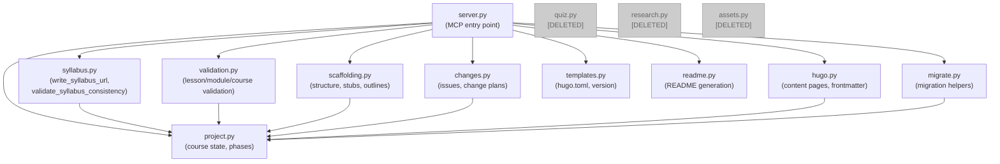

# Architecture Update — Sprint 001: Prune Unused Modules for CLI Migration

## What Changed

This sprint is a pure deletion sprint. No new modules are introduced. Three
modules are removed entirely and one is trimmed.

### Modules Removed

| Module | Was Responsible For |
|--------|---------------------|
| curik/quiz.py | Quiz stub generation, objective-to-topic alignment, status tracking |
| curik/research.py | Numbered file I/O for research findings in .course/research/ |
| curik/assets.py | Loading agent/skill/reference markdown from package resources; ACTIVITY_MAPPINGS |

### Module Trimmed

| Module | Removed Functions | Retained Functions |
|--------|------------------|--------------------|
| curik/syllabus.py | get_syllabus, regenerate_syllabus, read_syllabus_entries | write_syllabus_url, validate_syllabus_consistency, _iter_lessons (private helper) |

### MCP Tool Registrations Removed from server.py

Removed from the `## Quiz tools` section:
- tool_generate_quiz_stub
- tool_validate_quiz_alignment
- tool_set_quiz_status

Removed from the `## Research tools` section:
- tool_save_research_findings
- tool_get_research_findings

Removed from the `## Asset tools` and `## Process discovery tools` sections:
- tool_list_agents
- tool_get_agent_definition
- tool_list_skills
- tool_get_skill_definition
- tool_list_instructions
- tool_get_instruction
- tool_list_references (alias)
- tool_get_reference (alias)
- tool_get_process_guide
- tool_get_activity_guide

Removed from the `## Syllabus tools` section:
- tool_read_syllabus_entries
- tool_regenerate_syllabus
- tool_get_syllabus

### Preservation: ACTIVITY_MAPPINGS

The ACTIVITY_MAPPINGS dict from assets.py documents which agents, skills, and
instructions belong to each named activity. This information has reference value
for future CLI design and documentation. It is preserved as:

```
curik/references/activity-mappings.md
```

This is a new file in the existing curik/references/ directory.

### Tests Removed

- tests/test_assets_research.py — entirely deleted (covered quiz, asset loading,
  research)
- From tests/test_syllabus.py: ReadSyllabusEntriesTest, GetSyllabusTest, and
  MCPSyllabusToolTest methods for removed tools

### Templates Updated

- curik/init/claude-section.md — Syllabus section updated to remove
  regenerate_syllabus, get_syllabus, read_syllabus_entries; Quiz section removed;
  no research tools were listed there
- curik/init/curik-skill.md — no changes needed (the skill file only exposes
  status, spec, phase, validate, agents, skills, refs, and publish commands;
  it does not list quiz/research/syllabus tools directly)

## Why

The curik package is migrating from an MCP server model to a CLI. The first
step is reducing the module surface to only what will need CLI equivalents.

- **quiz.py** — the quiz authoring feature was never deployed or used. It adds
  test coverage burden and import surface with no current value.
- **research.py** — provides numbered file I/O that is trivially described in
  agent instructions. Claude can be told "save findings to .course/research/NNN-slug.md"
  without a server tool doing it.
- **assets.py** — serves agent/skill/reference markdown by using
  importlib.resources to read files from the package. When running as a CLI,
  Claude can read these same files directly from the filesystem (they live in
  curik/agents/, curik/skills/, curik/references/). The MCP wrappers add no
  value over direct file reads.
- **syllabus.py trimming** — get_syllabus is a one-liner (read a file);
  regenerate_syllabus wraps the syllabus library's compile_syllabus;
  read_syllabus_entries wraps Course.from_yaml. All three can be replaced by
  agent instructions describing what to do. write_syllabus_url and
  validate_syllabus_consistency contain non-trivial logic (YAML mutation, UID
  cross-referencing) that justifies staying as explicit tools.

## Module Diagram

The diagram shows the curik package module structure after this sprint.
Modules in grey are removed. Edges represent import dependencies.



## Impact on Existing Components

**server.py** — Loses approximately 25 tool registrations and three import
statements. The file shrinks but its structure and remaining tools are
unchanged. No interface changes for surviving tools.

**curik/syllabus.py** — The two retained functions (write_syllabus_url,
validate_syllabus_consistency) are unchanged. The _iter_lessons private helper
is retained because validate_syllabus_consistency calls it.

**curik/references/** — Gains activity-mappings.md. No existing files are
modified.

**tests/test_syllabus.py** — Loses three test classes. WriteSyllabusUrlTest and
ValidateSyllabusConsistencyTest are unchanged and continue to provide coverage.

**CLAUDE.md (curik project)** — The claude-section.md template generates the
CLAUDE.md that is installed in curriculum projects. Removing the quiz and
syllabus entries from that template means future `curik init` runs will produce
CLAUDE.md files without those tool references. Existing installed CLAUDE.md files
are not automatically updated.

## Design Rationale

### Decision: Preserve ACTIVITY_MAPPINGS as a markdown reference rather than deleting it

**Context**: The ACTIVITY_MAPPINGS dict maps ten activity names to (agent,
skills, instructions) triples. It is the only structured record of this
information in the codebase.

**Alternatives considered**:
1. Delete it — the information exists implicitly in the individual markdown files.
2. Preserve it as a Python constant in a different module.
3. Preserve it as a markdown table in curik/references/.

**Why this choice**: Option 3 makes it readable by both humans and agents without
requiring a Python import. It fits naturally in the existing references directory
alongside other reference documents. Option 2 would require keeping a Python
module alive solely for documentation.

**Consequences**: The markdown file has no automated consistency enforcement.
If agents or skills are added/renamed in the future, the file must be manually
updated.

### Decision: Retain _iter_lessons in syllabus.py

**Context**: _iter_lessons is a private helper used only by
validate_syllabus_consistency. The question is whether to inline it or keep it
separate.

**Alternatives considered**:
1. Delete it along with read_syllabus_entries (its only public caller).
2. Retain it as a private helper for validate_syllabus_consistency.

**Why this choice**: validate_syllabus_consistency is ~40 lines. Inlining
_iter_lessons would make it harder to read. Retaining the helper preserves
clarity at near-zero cost.

**Consequences**: None — _iter_lessons remains private and test-invisible.

## Open Questions

None. The deletions are straightforward; no ambiguity about what stays and what
goes.

## Migration Concerns

**Deployed MCP servers**: Any running curik MCP server will lose the removed
tools when the package is updated. Claude Code sessions that rely on
tool_list_agents, tool_get_activity_guide, tool_generate_quiz_stub, etc. will
receive "tool not found" errors. Since these tools are not used in production
curriculum projects (they exist only in the curik development repo), the impact
is limited to the curik project itself.

**CLAUDE.md in curriculum projects**: The init template change only affects
future `curik init` runs. Existing deployed CLAUDE.md files in curriculum
project repos will still list the old tools until they are regenerated.
This is acceptable; the old tools will simply be unavailable on the server.

**No data migration required**: Deleted modules do not own any persisted data
that needs to be migrated. The .course/research/ directory may exist in some
course projects but its contents are not touched by this sprint.
