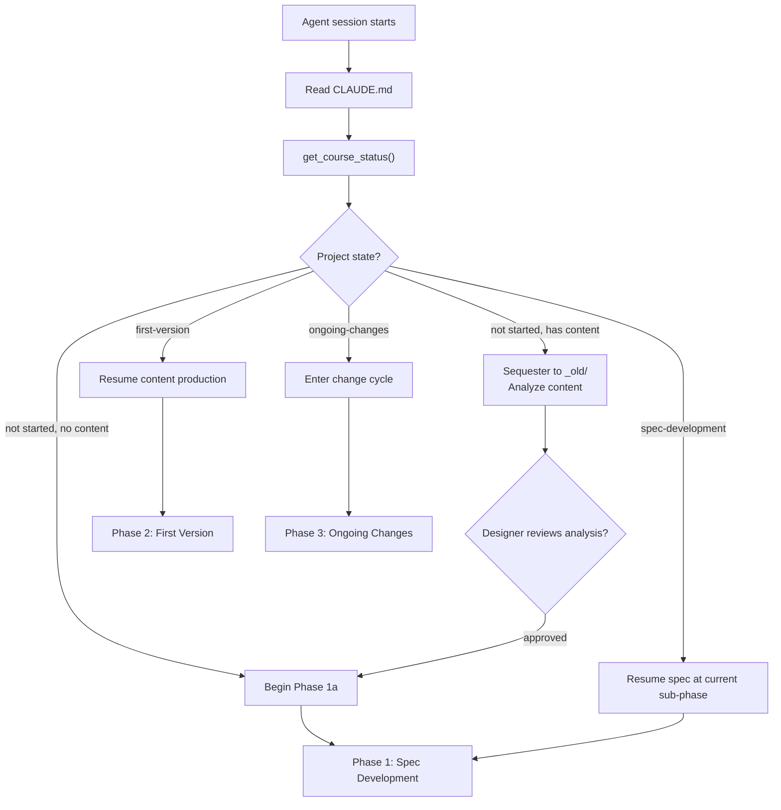
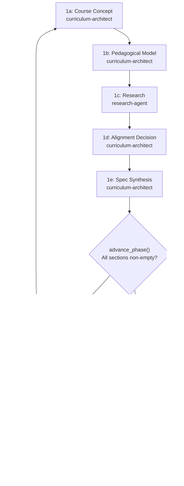
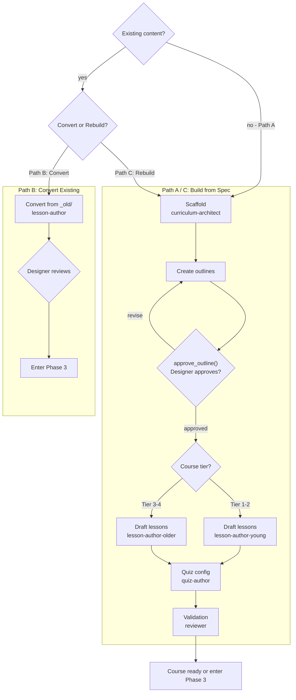
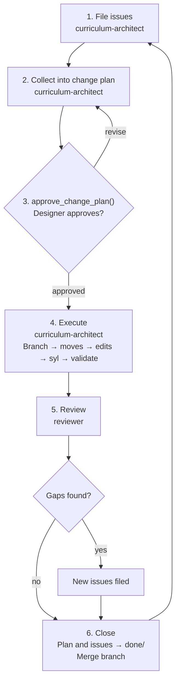
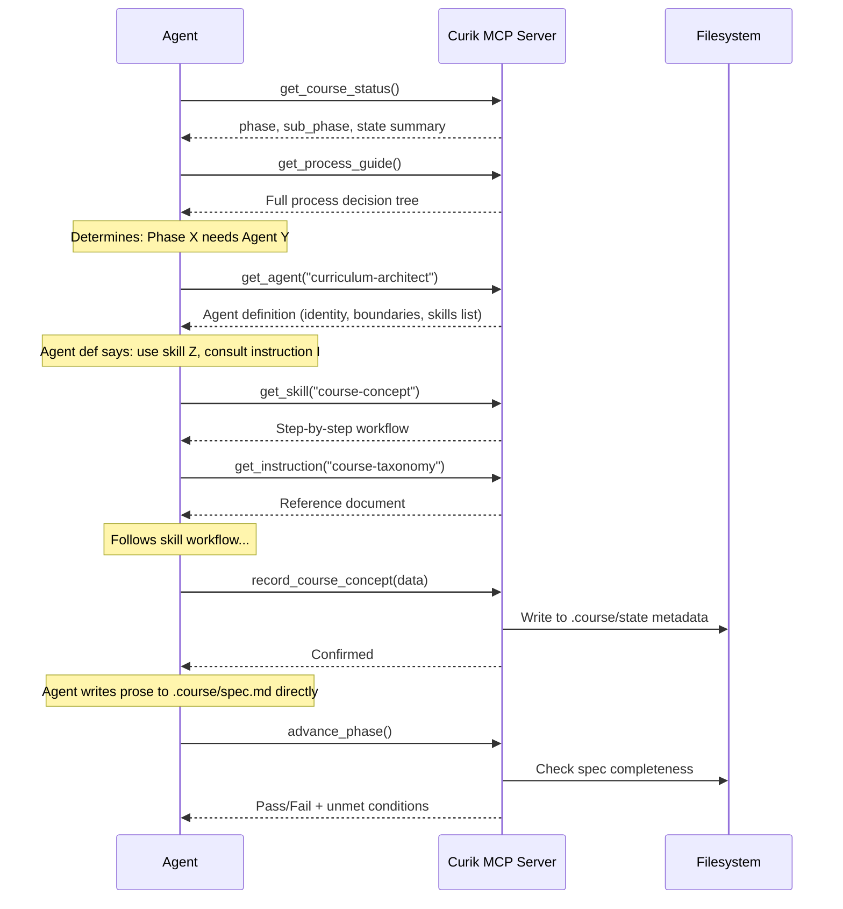
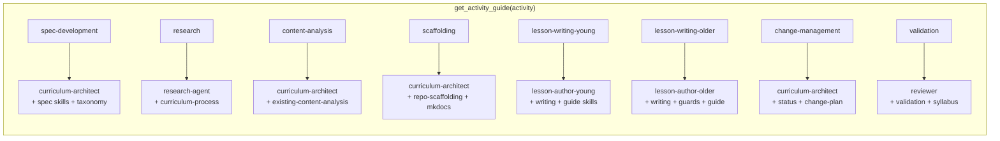

# Curik MCP Server — Agent Process Orchestration Specification

*Draft — 2026-03-13*

---

## What This Document Describes

This document specifies the Curik MCP server from the agent's perspective: what the server exposes, how the agent discovers what to do next, and how agent skills and instructions are delivered through MCP tool calls. The prior project plan (v2) defined what the process *is*. This document defines how the MCP server *guides the agent through it*.

The central design insight, inherited from CLASI: the MCP server is not just a collection of functions that do work. It is the agent's primary interface for understanding the process, selecting the right agent persona, loading the right skills and instructions, and determining what step comes next. The server is a process guide that happens to also have tools for file manipulation and state management.

---

## Design Principles

### The MCP Server Is a Process Coach

In CLASI, the `get_se_overview()` tool returns a curated process overview — agents, skills, instructions, and tool reference — all in one call. The `get_activity_guide(activity)` tool bundles everything needed for a specific activity: which agents to use, which skills to follow, which instructions apply. These are the most important tools in CLASI. Not `create_sprint` or `create_ticket` — those are plumbing. The process tools are what prevent the agent from going off the rails.

Curik follows this pattern. The MCP server's highest-value tools are the ones that tell the agent what to do and how to do it.

### Agent Skills and Instructions Are Bundled Content

`curik init` installs into the repo:

- A `CLAUDE.md` file that establishes the agent's top-level identity and process awareness
- A `.claude/` directory containing agent definitions, skill files, and instruction files as Markdown

These files are also available through MCP tool calls. The files on disk serve as the cold-start bootstrap (the agent reads `CLAUDE.md` on session start). The MCP tools serve as the runtime access path (the agent calls `get_agent`, `get_skill`, `get_instruction` to load what it needs as it progresses through the process).

Both paths deliver the same content. The MCP path exists because agents lose context over long sessions and need to reload instructions at the point of use, not just at session start.

### The Process Has Three Macro-Phases

The full curriculum development lifecycle has three macro-phases, each with distinct agent requirements:

1. **Project initiation** — analyze what we're starting with, build the course specification
2. **First version** — scaffold, outline, draft, validate (two paths: from-scratch or conversion)
3. **Ongoing changes** — the issue → change plan → execute → review cycle

The MCP server's top-level process guide describes all three. Within each, specific agents, skills, and instructions apply.

### What the MCP Server Owns vs. What the Agent Owns

The MCP server manages structured data, directory structure, numbering, state tracking, and gates. The agent writes all prose content (Markdown lesson pages, spec sections, outlines, research findings) directly to the filesystem.

**MCP server owns:**

- Structured data files: `.syllabus`, `course.yml`, `quiz.yml`, `.course/` state metadata (YAML/JSON)
- Directory creation and numbering (scaffold, stub files with correct frontmatter)
- Phase state and gate enforcement
- Validation (checking structured conditions across files)
- File moves between state directories (`issues/open/` → `issues/done/`)
- Running external tools (`syl compile`, README build, MkDocs build check)

**Agent writes directly:**

- `.course/spec.md` — all prose sections
- `.course/outlines/*.md` — outline documents
- Lesson pages in `docs/docs/`
- Issue descriptions in `.course/issues/open/`
- Change plan content in `.course/change-plan/active/`
- Any other Markdown or code file

The MCP server never needs to write or read prose on the agent's behalf. If a tool would just be a wrapper around "write this string to this file," the agent should write the file itself.

---

## Artifacts Installed by `curik init`

### `CLAUDE.md`

The top-level agent instruction file, placed at the repo root. This file:

1. Identifies this repo as a Curik-managed curriculum project
2. Instructs the agent to call `get_process_guide()` as its first action in any new session
3. Establishes the rule: **the agent must not write curriculum content, modify course structure, or scaffold files without first consulting the MCP server for the current phase and applicable agent**
4. Lists the available MCP tools by category (process discovery, agent/skill loading, state management, file operations)
5. Contains the pre-flight check: before doing anything, determine the current phase via `get_course_status()`, load the appropriate agent via `get_agent()`, and follow its instructions

`CLAUDE.md` is deliberately short — a routing document, not a process manual. The process manual lives in the MCP server and is delivered on demand.

### `.claude/agents/`

Markdown files defining each agent persona:

| File | Agent | Primary Phase |
|------|-------|---------------|
| `curriculum-architect.md` | Curriculum Architect | Phase 1 (spec), orchestration throughout |
| `research-agent.md` | Research Agent | Phase 1c (research) |
| `lesson-author-young.md` | Lesson Author — Young | Phase 2 (Tier 1–2 content) |
| `lesson-author-older.md` | Lesson Author — Older | Phase 2 (Tier 3–4 content) |
| `quiz-author.md` | Quiz Author | Phase 2 (quiz configuration) |
| `reviewer.md` | Reviewer | Phase 2 close, Phase 3 review |

Each file contains:

- **Identity**: who this agent is and what it does
- **Boundaries**: what it can and cannot do (hard limits)
- **Skills**: which skills this agent uses (by name — the agent calls `get_skill()` to load them)
- **Instructions**: which instructions this agent consults
- **Delegation**: who this agent delegates to and who delegates to it
- **Decision tree**: the explicit sequence of decisions the agent makes when active

### `.claude/skills/`

Markdown files defining step-by-step workflows:

| File | Skill | Used By |
|------|-------|---------|
| `course-concept.md` | Course Concept | Curriculum Architect |
| `pedagogical-model.md` | Pedagogical Model | Curriculum Architect |
| `alignment-decision.md` | Alignment Decision | Curriculum Architect |
| `spec-synthesis.md` | Spec Synthesis | Curriculum Architect |
| `structure-proposal.md` | Structure Proposal | Curriculum Architect |
| `resource-collection-spec.md` | Resource Collection Spec | Curriculum Architect |
| `existing-content-analysis.md` | Existing Content Analysis | Curriculum Architect |
| `content-conversion.md` | Content Conversion | Lesson Author (both) |
| `lesson-writing-young.md` | Lesson Writing — Young | Lesson Author — Young |
| `lesson-writing-older.md` | Lesson Writing — Older | Lesson Author — Older |
| `instructor-guide-sections.md` | Instructor Guide Sections | Lesson Author (both) |
| `quiz-authoring.md` | Quiz Authoring | Quiz Author |
| `readme-guards.md` | README Guards | Lesson Author — Older |
| `repo-scaffolding.md` | Repo Scaffolding | Curriculum Architect |
| `status-tracking.md` | Status Tracking | Curriculum Architect |
| `syllabus-integration.md` | Syllabus Integration | Curriculum Architect |
| `validation-checklist.md` | Validation Checklist | Reviewer |
| `change-plan-execution.md` | Change Plan Execution | Curriculum Architect |

### `.claude/instructions/`

Reference documents consulted during work:

| File | Instruction | Consulted By |
|------|-------------|-------------|
| `curriculum-process.md` | The full curriculum development process | All agents |
| `course-taxonomy.md` | Delivery formats, pedagogical structures, structural units | Curriculum Architect, Lesson Authors |
| `mkdocs-conventions.md` | MkDocs Material configuration, nav generation, page structure | Lesson Authors, Reviewer |
| `lesson-page-template.md` | Standard lesson page structure, content markers, frontmatter | Lesson Authors |
| `instructor-guide-requirements.md` | Required fields and quality standards for instructor guide sections | Lesson Authors, Reviewer |

---

## MCP Tool Categories

### Category 1: Process Discovery

These are the most important tools. They answer "what should I be doing right now?" and "how do I do it?"

#### `get_process_guide()`

**Parameters:** none

**Returns:** A Markdown document describing the full curriculum development process — all three macro-phases, the decision points between them, the agents involved at each stage, and the skills each agent uses. This is the equivalent of CLASI's `get_se_overview()`.

The document is structured as a decision tree:

1. What phase is this project in? (Check via `get_course_status()`)
2. For the current phase, which agent should be active?
3. For the active agent, which skills apply?
4. What are the gates that must be passed before advancing?

The process guide names agents and skills but does not include their full text. The agent reads the guide, identifies which agent and skill it needs, then calls `get_agent()` and `get_skill()` to load them.

This tool should be called at the start of every new session and whenever the agent is uncertain about what to do next.

#### `get_course_status()`

**Parameters:** none

**Returns:** A structured summary of the project's current state:

```yaml
phase: "spec-development"        # or "first-version", "ongoing-changes"
sub_phase: "1c-research"         # current sub-phase within the macro-phase
course_type: "course"            # or "resource-collection"
tier: 3
has_existing_content: true
existing_content_sequestered: true
spec_sections_complete:
  course_concept: true
  pedagogical_model: true
  research: false
  alignment: false
  synthesis: false
open_issues: 0
active_change_plans: 0
lessons_drafted: 0
lessons_total: 12                # from spec, 0 if spec incomplete
validation_last_run: null
```

This is the routing tool. The agent reads this output and determines which agent to activate, which skill to follow, and whether any gates are blocking progress.

#### `get_phase()`

**Parameters:** none

**Returns:** Current phase, sub-phase, and the specific gate conditions that must be met to advance. More detailed than `get_course_status()` for phase transition decisions.

#### `advance_phase()`

**Parameters:** none (advances to the next logical phase)

**Returns:** Success with new phase, or failure with a list of unmet gate conditions.

This is the enforcement mechanism. The agent cannot advance past Phase 1 until every required spec section contains real content. The agent cannot advance to drafting until outlines are approved. The check is mechanical, not advisory.

### Category 2: Agent, Skill, and Instruction Loading

These tools deliver the content that tells the agent *how* to do its work.

#### `list_agents()`

**Parameters:** none

**Returns:** Array of `{name, description, primary_phase}` for all available agents.

#### `get_agent(name)`

**Parameters:** `name` — agent identifier (e.g., `"curriculum-architect"`, `"research-agent"`)

**Returns:** The full Markdown content of the agent definition file. Contains identity, boundaries, skills list, decision tree, delegation rules.

When the agent loads an agent definition, it adopts that persona. The Curriculum Architect cannot write lesson content. The Lesson Author cannot modify course structure. These boundaries are in the agent definition, and the agent is expected to respect them (behavioral enforcement), while the MCP tools provide mechanical enforcement where possible (e.g., `advance_phase()` prevents skipping spec development).

#### `list_skills()`

**Parameters:** none

**Returns:** Array of `{name, description, used_by}` for all available skills.

#### `get_skill(name)`

**Parameters:** `name` — skill identifier (e.g., `"course-concept"`, `"lesson-writing-older"`)

**Returns:** The full Markdown content of the skill file. Contains the step-by-step workflow, decision points, output format, and quality criteria.

#### `list_instructions()`

**Parameters:** none

**Returns:** Array of `{name, description}` for all available instructions.

#### `get_instruction(name)`

**Parameters:** `name` — instruction identifier (e.g., `"course-taxonomy"`, `"lesson-page-template"`)

**Returns:** The full Markdown content of the instruction file.

#### `get_activity_guide(activity)`

**Parameters:** `activity` — a high-level activity name that maps to a bundle of agent + skills + instructions.

**Returns:** A composite document combining the relevant agent definition, all applicable skills, and all applicable instructions for the named activity. This is the "give me everything I need for this task" shortcut.

Activity mappings:

| Activity | Agent | Skills | Instructions |
|----------|-------|--------|-------------|
| `spec-development` | curriculum-architect | course-concept, pedagogical-model, alignment-decision, spec-synthesis | curriculum-process, course-taxonomy |
| `research` | research-agent | (none — web search driven) | curriculum-process |
| `content-analysis` | curriculum-architect | existing-content-analysis | curriculum-process, course-taxonomy |
| `scaffolding` | curriculum-architect | repo-scaffolding, structure-proposal, syllabus-integration | mkdocs-conventions |
| `lesson-writing-young` | lesson-author-young | lesson-writing-young, instructor-guide-sections | lesson-page-template, instructor-guide-requirements, course-taxonomy |
| `lesson-writing-older` | lesson-author-older | lesson-writing-older, instructor-guide-sections, readme-guards | lesson-page-template, instructor-guide-requirements, mkdocs-conventions |
| `quiz-authoring` | quiz-author | quiz-authoring | curriculum-process |
| `content-conversion` | lesson-author (both) | content-conversion, instructor-guide-sections | lesson-page-template, mkdocs-conventions |
| `change-management` | curriculum-architect | status-tracking, change-plan-execution | curriculum-process |
| `validation` | reviewer | validation-checklist, syllabus-integration | mkdocs-conventions, instructor-guide-requirements |

### Category 3: Spec State (Phase 1)

The agent writes `.course/spec.md` directly — it's a Markdown file and prose authoring is the agent's job. These tools manage the structured metadata that `get_course_status()` reads back: tier, grade range, delivery format, pedagogical structure, alignment targets. They also update the phase-tracking state so `advance_phase()` knows which sections are complete.

| Tool | Description |
|------|-------------|
| `record_course_concept(data)` | Records structured fields from Phase 1a: tier, grade range, format, course type, scope. Updates phase state to mark 1a complete. |
| `record_pedagogical_model(data)` | Records delivery format and pedagogical structure choices. Updates phase state to mark 1b complete. |
| `record_alignment(data)` | Records alignment target(s) and topic list. Updates phase state to mark 1d complete. |

The agent writes the prose for each sub-phase into `spec.md` itself. The `record_*` tools extract and store the structured decisions that other tools depend on — `scaffold_structure()` needs to know the tier, `get_course_status()` needs to report which sub-phases are done, and `advance_phase()` needs to check completeness.

### Category 4: Scaffolding and Structure

| Tool | Description |
|------|-------------|
| `scaffold_structure(change_plan_id)` | Creates directories and stub files from an approved change plan |
| `create_lesson_stub(module, lesson, metadata)` | Creates a stub lesson page with frontmatter |
| `generate_mkdocs_nav(source?)` | Generates the `mkdocs.yml` nav section from course spec or current directory state |

### Category 5: Syllabus Integration

| Tool | Description |
|------|-------------|
| `regenerate_syllabus()` | Runs `syl compile` to rebuild `.syllabus` from the current directory state |
| `get_syllabus()` | Reads `.syllabus` and returns structured entries: UIDs, paths, titles, and `url` fields |
| `write_syllabus_url(uid, url)` | Writes the `url` field for a lesson entry after the agent creates the corresponding MkDocs page |
| `trigger_readme_generation()` | Runs the README build tool |
| `validate_syllabus_consistency()` | Checks that every `.syllabus` entry has a corresponding MkDocs page, UIDs match, Tier 3–4 entries have `url` fields |

### Category 6: Outlines

The agent writes outline documents to `.course/outlines/` directly — they're Markdown prose. The MCP server handles the approval gate.

| Tool | Description |
|------|-------------|
| `approve_outline(outline_id)` | Human-gated; records outline approval in state metadata, enables drafting for that module |

### Category 7: Issue and Change Plan Management

The agent writes issue descriptions and change plan content as Markdown. The MCP server handles numbering, directory placement, state metadata, and file moves between `open/`/`active/` and `done/`.

| Tool | Description |
|------|-------------|
| `create_issue(description)` | Creates a numbered file in `issues/open/` with correct sequence number and frontmatter. The agent provides the description text. |
| `list_issues(filter?)` | Reads frontmatter from issue files and returns a filtered, structured list |
| `register_change_plan(plan_id)` | Registers a change plan the agent has written in `change-plan/active/`. Validates the file exists, indexes its items, records it in state metadata. |
| `approve_change_plan(plan_id)` | Records designer approval in the plan's frontmatter; updates state to allow execution |
| `close_change_plan(plan_id)` | Moves plan to `change-plan/done/`, moves resolved issues to `issues/done/` |

The agent synthesizes issues into a change plan (that's a language model task — reading issues and writing a coherent plan document). The agent also executes the plan by making the file edits and content changes directly. The MCP server tracks which plans exist, whether they're approved, and handles the directory moves at close time.

### Category 8: Validation

| Tool | Description |
|------|-------------|
| `validate_lesson(lesson_id)` | Checks instructor guide, objectives, `.syllabus` linkage, comment guards |
| `validate_module(module_id)` | Checks all lessons, module overview |
| `validate_course()` | Full pre-publication check |
| `get_validation_report()` | Reads the last validation run |

### Category 9: Quiz

| Tool | Description |
|------|-------------|
| `generate_quiz_stub(lesson_id)` | Creates `quiz.yml` skeleton from lesson topics |
| `validate_quiz_alignment(lesson_id)` | Checks quiz topics cover lesson objectives |
| `set_quiz_status(lesson_id, status)` | Marks quiz as drafted/reviewed/complete |

---

## Process Flow

This section describes the full process from the agent's perspective — what happens, in what order, and which MCP tools are used at each step.

### Session Entry and Routing



### Macro-Phase 1: Project Initiation

#### Entry Point

The agent's session begins. It reads `CLAUDE.md`, which instructs it to call `get_process_guide()`. The process guide tells the agent to call `get_course_status()` to determine where the project stands.

#### Branch: Empty Repo vs. Existing Content

`get_course_status()` reports `has_existing_content`. Two paths diverge:

**Path: Empty Repo**



1. Agent loads the Curriculum Architect via `get_agent("curriculum-architect")`
2. Agent begins Phase 1a (Course Concept) using `get_skill("course-concept")`
3. Agent has a structured conversation with the designer, recording answers via `record_course_concept()`
4. Agent proceeds through 1b (Pedagogical Model) → `get_skill("pedagogical-model")` → `record_pedagogical_model()`
5. Agent delegates to Research Agent for 1c → `get_agent("research-agent")` → web search → agent writes findings into `spec.md` directly
6. Agent returns to Curriculum Architect for 1d (Alignment) → `get_skill("alignment-decision")` → `record_alignment()`
7. Agent synthesizes the spec in 1e → `get_skill("spec-synthesis")` → agent writes each section of `spec.md` directly
8. Agent calls `advance_phase()` — fails if any spec section is empty, succeeds if all are complete

**Path: Existing Content**

1. Agent loads the Curriculum Architect via `get_agent("curriculum-architect")`
2. Agent loads `get_skill("existing-content-analysis")`
3. Agent asks the designer: "I see existing content. Should I sequester these files and analyze them?"
4. If yes: agent moves existing files to `_old/`, produces an analysis report
5. Agent presents the analysis and asks the designer to confirm or correct its understanding
6. Agent proceeds through Phase 1 sub-phases, but each question is informed by the analysis — "The existing curriculum covers X. Do you want to keep this scope?"
7. Same spec development flow as empty repo, same gate at the end

The analysis report covers: topics, structure, pedagogical approach, strengths, gaps, target audience, assumed prerequisites.

### Macro-Phase 2: First Version

#### Branch: From Scratch (Path A) vs. Convert (Path B) vs. Rebuild (Path C)

After the spec is approved and `advance_phase()` succeeds, the agent produces an initial change plan (`change-plan/active/001-initial-build.md`). The designer reviews and approves it.

The agent then asks the designer which path to follow if existing content was sequestered:



**Path A: From Scratch (no existing content, or existing content used only as reference)**

1. Agent loads `get_skill("repo-scaffolding")` and calls `scaffold_structure()`
2. For Tier 3–4: `regenerate_syllabus()` runs `syl compile`
3. Agent loads `get_skill("structure-proposal")` and creates outlines in `.course/outlines/`
4. Designer reviews outlines → `approve_outline()` for each
5. Agent selects the appropriate Lesson Author:
   - Tier 1–2: `get_agent("lesson-author-young")` + `get_skill("lesson-writing-young")`
   - Tier 3–4: `get_agent("lesson-author-older")` + `get_skill("lesson-writing-older")`
6. Author writes lessons module by module, following the skill's step-by-step workflow
7. For each lesson written (Tier 3–4): `write_syllabus_url()` links the MkDocs page
8. After each module: `trigger_readme_generation()` for Tier 3–4
9. Quiz Author creates quiz configs: `get_agent("quiz-author")` + `get_skill("quiz-authoring")`
10. Reviewer validates: `get_agent("reviewer")` + `validate_course()`

**Path B: Convert Existing Content**

1. Agent loads `get_skill("content-conversion")`
2. Agent reads old content from `_old/` and converts to standard Curik structure
3. Conversion produces: directory layout, MkDocs pages, instructor guide stubs, correct naming
4. Agent runs scaffolding tools, `regenerate_syllabus()`
5. Designer reviews converted result
6. Project enters Macro-Phase 3 (ongoing changes) to fix conversion issues

**Path C: Rebuild Informed by Old Content**

Same as Path A, but the Lesson Author has `_old/` as a reference source. The skill instructions tell the author: draw explanations, examples, and exercise ideas from the old content where applicable, but the structure and sequence come from the new spec.

### Macro-Phase 3: Ongoing Changes

This is the steady-state cycle. The project stays here for its lifetime.

#### The Change Cycle



1. **Comment**: Designer reviews lessons, uses the site, works through exercises. Tells the agent what needs to change. Agent records each comment via `create_issue()`.
2. **Collect**: At intervals, the designer asks the agent to collect issues. The agent reads all open issues (via `list_issues()`) and writes a change plan document in `change-plan/active/`, then calls `register_change_plan()` to index it. Structural moves listed first, content changes second.
3. **Approve**: Designer reviews the plan. Agent calls `approve_change_plan()` when the designer confirms.
4. **Execute**: Agent loads `get_skill("change-plan-execution")`. This skill defines the execution order:
   - Create a git branch for the change set
   - Execute structural moves (file renames, directory changes) first
   - Execute content edits second
   - Run `regenerate_syllabus()` to update `.syllabus`
   - Run `trigger_readme_generation()` for Tier 3–4
   - Run `validate_course()` or `validate_module()` on affected areas
5. **Review**: Agent loads `get_agent("reviewer")` + `get_skill("validation-checklist")`. Reviewer checks the change plan line by line. Gaps become new issues.
6. **Close**: Agent calls `close_change_plan()`. Plan moves to `done/`, resolved issues move to `done/`. Designer reviews the branch and merges (or the agent merges with designer approval).

The cycle restarts.

#### Proposing Changes

Changes can originate from:

- **Designer comments**: "Lesson 3 is too long" → `create_issue()`
- **Validation failures**: `validate_course()` finds missing instructor guide → `create_issue()`
- **Agent observations**: during lesson writing, the agent notices a gap → suggests an issue to the designer → `create_issue()` if approved

All three paths produce the same artifact: a numbered issue file in `.course/issues/open/`.

---

## Agent–MCP Interaction Pattern

The standard interaction pattern for any task:



Numbered summary:

```
1. Agent calls get_course_status() → learns current phase
2. Agent calls get_process_guide() → learns what to do in this phase
3. Process guide says: "For phase X, use agent Y with skills Z1, Z2"
4. Agent calls get_agent("Y") → loads agent definition, adopts persona
5. Agent definition says: "Use skills Z1 and Z2, consult instructions I1 and I2"
6. Agent calls get_skill("Z1") → loads step-by-step workflow
7. Agent calls get_instruction("I1") → loads reference material
8. Agent follows the skill workflow, using MCP state tools as needed
9. Agent calls advance_phase() when the phase is complete
10. Loop back to step 1 for the next phase
```

For long sessions, the agent re-calls `get_course_status()` periodically to confirm it hasn't drifted. If the agent is unsure what to do next, it calls `get_process_guide()` again — the guide includes a decision tree for every state the project can be in.

The shortcut: `get_activity_guide(activity)` bundles steps 4–7 into one call when the agent already knows which activity it's performing.

### Activity Guide Mapping



---

## Enforcement Model

### Mechanical Enforcement (via MCP tools)

| Gate | What It Prevents | Tool |
|------|-----------------|------|
| Spec completeness | Moving to content production with incomplete spec | `advance_phase()` |
| Outline approval | Drafting lessons without approved outlines | `approve_outline()` |
| Change plan approval | Executing changes without designer approval | `approve_change_plan()` |
| Lesson validation | Publishing lessons missing instructor guide or comment guards | `validate_lesson()` |
| Syllabus consistency | Publishing with broken `.syllabus` ↔ MkDocs linkage | `validate_syllabus_consistency()` |
| Course validation | Publishing an incomplete course | `validate_course()` |

### Behavioral Enforcement (via agent definitions and skills)

| Rule | What It Prevents | Source |
|------|-----------------|--------|
| Agent role boundaries | Architect writing lessons, Author modifying structure | Agent definitions |
| Skill step sequences | Skipping intermediate steps in a workflow | Skill files |
| Pre-flight check | Acting without consulting process state | `CLAUDE.md` |
| MCP-first routing | Using generic file editing instead of Curik tools for state changes | `CLAUDE.md` |

### What CLASI Taught Us

Every CLASI process failure was `ignored-instruction`. The agent knew the rules and violated them anyway. Curik's response:

- Everything that *can* be gated mechanically *is* gated mechanically. You cannot `advance_phase()` without a complete spec. You cannot draft without approved outlines.
- Everything that *cannot* be gated mechanically is documented as explicit binary decision trees in agent definitions, not vague guidelines. "Check if the instructor guide section is present. If yes, proceed. If no, stop and write it."
- Agent specialization limits blast radius. The Lesson Author literally does not have instructions for modifying course structure. It would have to improvise, and improvisation is where violations happen.

---

## `CLAUDE.md` — Full Content

```markdown
# Curik Curriculum Project

This repository is a Curik-managed curriculum project for the League of Amazing Programmers.

## Before You Do Anything

1. Call `get_course_status()` to determine where this project stands.
2. Call `get_process_guide()` to understand what to do next.
3. Follow the process guide's instructions for the current phase.

Do not write curriculum content, modify course structure, scaffold files, or make any substantive changes without first consulting the MCP server for the current phase and the applicable agent.

## Rules

- **MCP-first**: For any operation that Curik has a tool for (creating issues, managing change plans, scaffolding, validation, syllabus operations), use the Curik MCP tool. Do not perform these operations by directly editing files.
- **Agent boundaries**: When you load an agent definition via `get_agent()`, respect its boundaries. The Curriculum Architect does not write lesson content. The Lesson Author does not modify course structure.
- **Skills are workflows**: When you load a skill via `get_skill()`, follow its steps in order. Do not skip steps.
- **Gates are gates**: When `advance_phase()` fails, do not work around it. Address the unmet conditions.
- **Designer approval**: Change plans, outlines, and phase transitions require designer approval. Do not self-approve.

## Available MCP Tools

### Process Discovery
- `get_process_guide()` — full process overview and decision tree
- `get_course_status()` — current project state
- `get_phase()` — current phase and gate conditions
- `advance_phase()` — gated phase transition

### Agent and Skill Loading
- `list_agents()` / `get_agent(name)` — agent definitions
- `list_skills()` / `get_skill(name)` — skill workflows
- `list_instructions()` / `get_instruction(name)` — reference documents
- `get_activity_guide(activity)` — bundled agent + skills + instructions

### State Management
- Spec state: `record_course_concept`, `record_pedagogical_model`, `record_alignment`
- Scaffolding: `scaffold_structure`, `create_lesson_stub`, `generate_mkdocs_nav`
- Syllabus: `regenerate_syllabus`, `get_syllabus`, `write_syllabus_url`, `trigger_readme_generation`, `validate_syllabus_consistency`
- Outlines: `approve_outline`
- Issues and change plans: `create_issue`, `list_issues`, `register_change_plan`, `approve_change_plan`, `close_change_plan`
- Validation: `validate_lesson`, `validate_module`, `validate_course`, `get_validation_report`
- Quiz: `generate_quiz_stub`, `validate_quiz_alignment`, `set_quiz_status`
```

---

## Relationship to Prior Documents

This document supersedes the MCP tools section (Section 7) of `curik-project-plan-v2.md` for the purpose of defining the agent-facing MCP interface. The project plan remains authoritative for everything else: curriculum tiers, repository structure, course taxonomy, enforcement philosophy, quiz system, student identity, curriculum registry, and migration plan.

The agent definitions, skills, and instructions listed in this document are specified at the inventory level (names, purposes, agent assignments). Their full content is a separate authoring task — each agent definition, skill file, and instruction file needs to be written as a complete Markdown document following the patterns established in CLASI's content assets.
