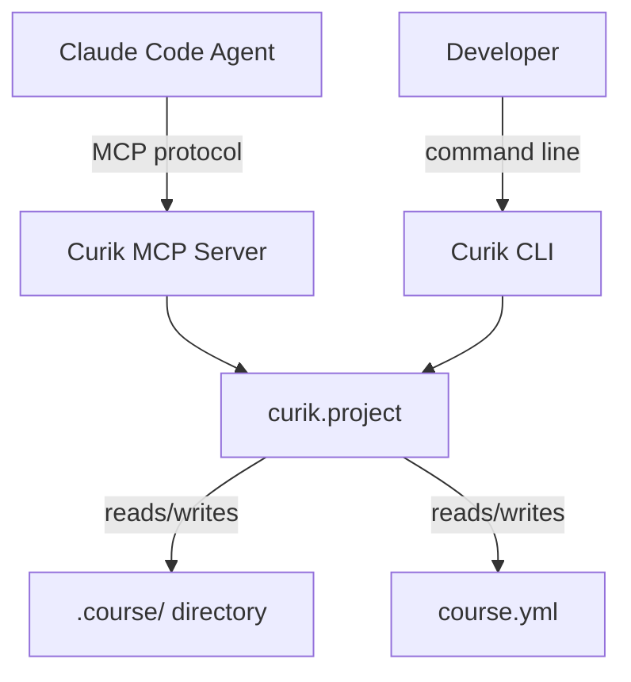
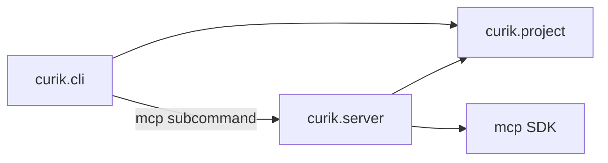

# Architecture

## Architecture Overview

Curik is a Python package with two entry points: a CLI (`curik`) and an MCP
server (`curik mcp`). Both delegate to a shared core module (`curik.project`)
that manages file-based state in the `.course/` directory.

## Technology Stack

- **Language**: Python >=3.10
- **Build**: setuptools >=68
- **CLI**: argparse (existing)
- **MCP**: `mcp` Python SDK (stdio transport)
- **State**: JSON + Markdown files (no database)
- **Testing**: unittest

The MCP SDK is the standard Python library for building MCP servers. Stdio
transport is used because Claude Code launches MCP servers as child processes.

## Component Design

### Component: MCP Server (`curik.server`)

**Purpose**: Expose Curik's project management functions as MCP tools.

**Boundary**: Translates MCP protocol messages to `curik.project` function
calls and formats responses. Contains no business logic.

**Use Cases**: SUC-001, SUC-002, SUC-003

The server registers each tool with the MCP SDK, providing name, description,
and input schema. When a tool is called, it:
1. Extracts parameters from the MCP request
2. Calls the corresponding `curik.project` function
3. Returns the result as MCP content (text or structured)
4. Catches `CurikError` and returns MCP error responses

### Component: Project Core (`curik.project`)

**Purpose**: Manage curriculum project state through file operations.

**Boundary**: All business logic for init, phase tracking, spec management.
Already implemented — this sprint adds no new functionality here.

**Use Cases**: SUC-001, SUC-002, SUC-003 (via MCP Server delegation)

### Component: CLI (`curik.cli`)

**Purpose**: Provide command-line access to project functions.

**Boundary**: Already implemented. This sprint adds the `mcp` subcommand
that starts the MCP server.

## Dependency Map

## Data Model

No changes to the data model. State remains in:
- `.course/state.json` — phase tracking (JSON)
- `.course/spec.md` — course specification (Markdown with sections)
- `course.yml` — course metadata (YAML)

## Security Considerations

- MCP server runs locally only (stdio transport, no network exposure)
- No authentication needed (single-user, local process)
- File operations are scoped to the project directory

## Design Rationale

**Thin MCP wrapper**: The MCP server contains zero business logic. It
delegates to `curik.project` for all operations. The MCP server exposes a
superset of CLI commands — convenience tools like `record_course_concept`,
`record_pedagogical_model`, and `record_alignment` are available as MCP
tools but have no CLI equivalents (they call `update_spec` internally).
This is intentional: agents benefit from purpose-specific tools while the
CLI keeps a smaller surface.

**Stdio transport**: Claude Code launches MCP servers as child processes
communicating over stdin/stdout. This is the standard pattern — no HTTP
server, no ports, no configuration.

**Single `server.py` module**: All MCP tool registrations in one file.
As the tool count grows in future sprints, we may split into tool groups,
but for 9 tools a single module is cleaner.

## Open Questions

None — this sprint is straightforward infrastructure wrapping.

## Sprint Changes

### Changed Components

- **Added**: `curik/server.py` — MCP server module with tool registrations
- **Modified**: `curik/cli.py` — add `mcp` subcommand that starts the server
- **Modified**: `curik/project.py` — add `get_course_status()` function
  (reads state.json, counts open issues, returns summary)
- **Modified**: `curik/__init__.py` — export server entry point and
  `get_course_status`
- **Modified**: `pyproject.toml` — add `mcp` SDK dependency, bump version
  to 0.2.0
- **Added**: `tests/test_mcp_server.py` — integration tests for MCP tools

### Migration Concerns

None — this is additive. No existing functionality changes.
