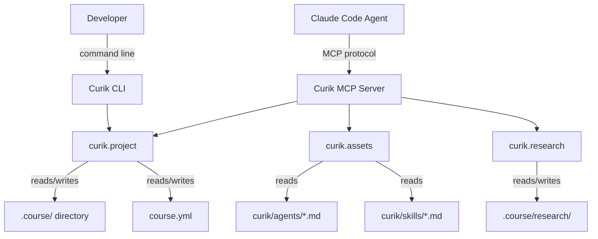
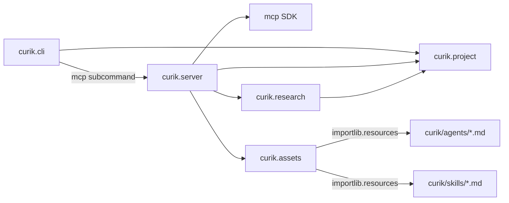

<!-- CLASI: Before changing code or making plans, review the SE process in CLAUDE.md -->

# Architecture

## Architecture Overview

Curik is a Python package with two entry points: a CLI (`curik`) and an
MCP server (`curik mcp`). Both delegate to a shared core module
(`curik.project`) that manages file-based state in the `.course/`
directory. This sprint adds bundled content assets (agent definitions and
skill files) served through the MCP server, and research persistence
tools.



## Technology Stack

- **Language**: Python >=3.10
- **Build**: setuptools >=68
- **CLI**: argparse (existing)
- **MCP**: `mcp` Python SDK (stdio transport)
- **State**: JSON + Markdown files (no database)
- **Asset loading**: `importlib.resources` (standard library)
- **Testing**: unittest

No new external dependencies beyond the MCP SDK added in Sprint 001.
Agent and skill files are bundled as package data using setuptools
`package-data` configuration.

## Component Design

### Component: Asset Loader (`curik.assets`)

**Purpose**: Load bundled agent definitions and skill files from the
package.

**Boundary**: Reads markdown files from `curik/agents/` and
`curik/skills/` directories within the installed package. Returns raw
markdown content. Does not interpret or modify the content.

**Use Cases**: SUC-001, SUC-002, SUC-003

The asset loader uses `importlib.resources` to read files from the
package, making it work correctly whether Curik is installed as a
package, run from source, or installed in editable mode. It provides
two functions:

- `get_agent_definition(name: str) -> str` -- reads
  `curik/agents/{name}.md` and returns the content
- `get_skill_definition(name: str) -> str` -- reads
  `curik/skills/{name}.md` and returns the content

Both raise `CurikError` if the requested file does not exist.

### Component: Research Module (`curik.research`)

**Purpose**: Persist and retrieve structured research findings.

**Boundary**: Manages files in `.course/research/`. Does not perform
actual web searches (that is delegated to the host environment).

**Use Cases**: SUC-002

Functions:

- `save_research_findings(root, title, finding_type, sources, summary)`
  -- creates a numbered markdown file in `.course/research/` with YAML
  frontmatter (title, type, sources, date) and markdown body (summary)
- `get_research_findings(root)` -- reads all files in
  `.course/research/`, returns a list of findings with frontmatter and
  body
- `web_search(query)` -- thin wrapper that formats a search query for
  the host environment; in practice the MCP tool delegates to Claude
  Code's built-in web search and structures the results

### Component: MCP Server (`curik.server`)

**Purpose**: Expose Curik's project management functions as MCP tools.

**Boundary**: Translates MCP protocol messages to function calls in
`curik.project`, `curik.assets`, and `curik.research`. Contains no
business logic.

**Use Cases**: SUC-001, SUC-002, SUC-003

New tool registrations in this sprint:

| Tool | Delegates To |
|------|-------------|
| `get_agent_definition` | `curik.assets.get_agent_definition` |
| `get_skill_definition` | `curik.assets.get_skill_definition` |
| `web_search` | `curik.research.web_search` |
| `save_research_findings` | `curik.research.save_research_findings` |
| `get_research_findings` | `curik.research.get_research_findings` |

### Component: Project Core (`curik.project`)

**Purpose**: Manage curriculum project state through file operations.

**Boundary**: All business logic for init, phase tracking, spec
management. This sprint modifies `init_course` to also create the
`.course/research/` directory.

**Use Cases**: SUC-001 (via MCP Server delegation)

### Component: CLI (`curik.cli`)

**Purpose**: Provide command-line access to project functions.

**Boundary**: No changes in this sprint. The CLI does not expose agent,
skill, or research commands -- those are agent-facing tools served
exclusively through MCP.

## Dependency Map



## Data Model

Existing state files are unchanged:

- `.course/state.json` -- phase tracking (JSON)
- `.course/spec.md` -- course specification (Markdown with sections)
- `course.yml` -- course metadata (YAML)

New data:

- `.course/research/NNN-slug.md` -- numbered research findings. Each
  file has YAML frontmatter and a markdown body:

```yaml
---
id: "001"
title: "PCEP Certification Syllabus"
type: standard
date: 2026-03-11
sources:
  - https://pythoninstitute.org/pcep
  - https://pythoninstitute.org/pcep-exam-syllabus
---

## Summary

The PCEP (Certified Entry-Level Python Programmer) exam covers...

## Relevance

This syllabus provides a complete topic list for...

## Recommended Use

Align the course to PCEP topics as the primary...
```

Numbering is auto-incremented by `save_research_findings` based on the
highest existing number in `.course/research/`.

## Package Data Layout

Agent definitions and skill files are bundled as package data:

```
curik/
  __init__.py
  cli.py
  project.py
  server.py          # Sprint 001
  assets.py          # New: asset loader
  research.py        # New: research persistence
  agents/
    __init__.py      # Empty, marks as package for importlib
    curriculum-architect.md
    research-agent.md
  skills/
    __init__.py      # Empty, marks as package for importlib
    course-concept.md
    pedagogical-model.md
    alignment-decision.md
    spec-synthesis.md
    structure-proposal.md
```

`pyproject.toml` is updated to include package data:

```toml
[tool.setuptools.package-data]
"curik.agents" = ["*.md"]
"curik.skills" = ["*.md"]
```

And `packages` is updated to include the sub-packages:

```toml
[tool.setuptools]
packages = ["curik", "curik.agents", "curik.skills"]
```

## Security Considerations

- MCP server runs locally only (stdio transport, no network exposure)
- No authentication needed (single-user, local process)
- File operations are scoped to the project directory
- Agent and skill files are read-only package data; the MCP server
  cannot modify them
- Web search delegates to the host environment -- Curik does not make
  direct HTTP requests or manage API keys

## Design Rationale

**Bundled markdown over generated content**: Agent definitions and skill
files are hand-authored markdown files shipped inside the package, not
generated at runtime. This makes them version-controlled, reviewable,
and testable. The content is the product -- it encodes the curriculum
development process knowledge.

**importlib.resources over file paths**: Using `importlib.resources`
rather than `__file__`-relative paths ensures the assets load correctly
regardless of installation method (regular install, editable install,
zipimport). This is the standard approach for Python package data.

**Separate assets module**: The asset loader is a distinct module rather
than inline code in the server. This allows unit testing of asset
loading independently of MCP protocol handling, and provides a clean
API for any future non-MCP consumers.

**Research as numbered files**: Following the CLASI numbered-artifact
pattern. Each finding is a self-contained document. The numbering
provides ordering and prevents naming collisions. YAML frontmatter
provides structured metadata; the markdown body provides the prose
summary the agent and designer review.

**web_search as thin wrapper**: The MCP server runs inside Claude Code,
which already has web search. Rather than implementing a separate search
client with API keys, `web_search` delegates to the environment. The
Curik tool adds curriculum-domain framing and structures results for
persistence via `save_research_findings`.

## Open Questions

1. **Agent handoff mechanism**: How does the Curriculum Architect
   formally hand off to the Research Agent and get control back? In
   Claude Code, this is likely a prompt-based delegation rather than a
   process-level handoff. The agent definitions should describe the
   protocol, but the MCP server does not enforce it mechanically.

2. **Skill versioning**: As skills evolve, do we version them or just
   update in place? For now, skills are updated in place and versioned
   with the package. If backward compatibility becomes an issue, we can
   add versioned skill files later.

## Sprint Changes

### Changed Components

- **Added**: `curik/assets.py` -- asset loader module with
  `get_agent_definition()` and `get_skill_definition()` functions
- **Added**: `curik/research.py` -- research persistence module with
  `save_research_findings()`, `get_research_findings()`, and
  `web_search()` functions
- **Added**: `curik/agents/curriculum-architect.md` -- Curriculum
  Architect agent definition
- **Added**: `curik/agents/research-agent.md` -- Research Agent
  definition
- **Added**: `curik/agents/__init__.py` -- empty init for package data
- **Added**: `curik/skills/course-concept.md` -- Phase 1a skill
- **Added**: `curik/skills/pedagogical-model.md` -- Phase 1b skill
- **Added**: `curik/skills/alignment-decision.md` -- Phase 1d skill
- **Added**: `curik/skills/spec-synthesis.md` -- Phase 1e skill
- **Added**: `curik/skills/structure-proposal.md` -- Phase 1 to Phase 2
  handoff skill
- **Added**: `curik/skills/__init__.py` -- empty init for package data
- **Modified**: `curik/server.py` -- register five new MCP tools
  (`get_agent_definition`, `get_skill_definition`, `web_search`,
  `save_research_findings`, `get_research_findings`)
- **Modified**: `curik/project.py` -- add `.course/research/` to
  `init_course` directory list
- **Modified**: `pyproject.toml` -- add `curik.agents` and
  `curik.skills` to packages, add package-data glob for `*.md`, bump
  version to 0.3.0
- **Added**: `tests/test_assets.py` -- unit tests for asset loading
- **Added**: `tests/test_research.py` -- unit tests for research
  persistence

### Migration Concerns

None -- this is additive. No existing functionality changes. The only
modification to existing code is adding `.course/research/` to the
`init_course` directory list, which is backward-compatible (existing
projects without the directory still work; new projects get it
automatically).
