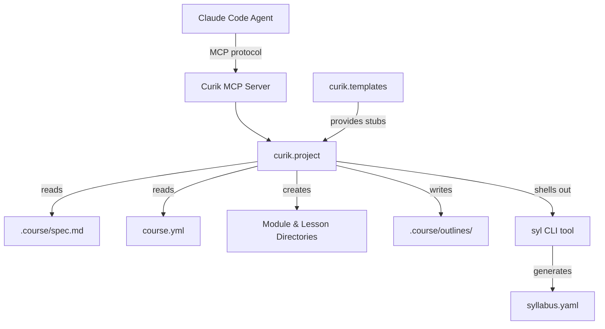
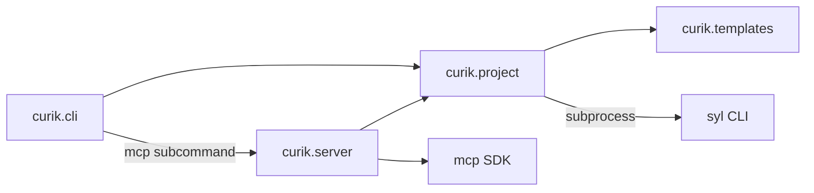
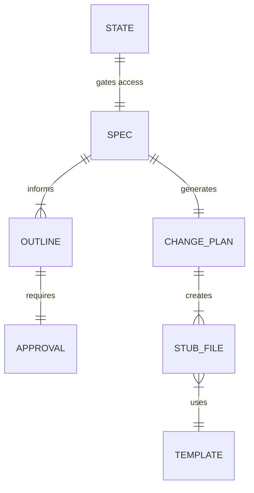

<!-- CLASI: Before changing code or making plans, review the SE process in CLAUDE.md -->

# Architecture

## Architecture Overview

This sprint extends the Curik MCP server with Phase 2 tools for scaffolding
and outline management. The existing architecture (CLI, MCP Server, Project
Core) remains unchanged — new functionality is added as additional MCP tools
backed by new functions in `curik.project` and a new `curik.templates`
module for tier-specific stub templates.



## Technology Stack

- **Language**: Python >=3.10
- **Build**: setuptools >=68
- **CLI**: argparse (existing)
- **MCP**: `mcp` Python SDK (stdio transport)
- **State**: JSON + Markdown files in `.course/` (no database)
- **Testing**: unittest
- **External dependency**: `syl` CLI tool (called via `subprocess`)

No new framework dependencies. The `syl` tool is an existing League
infrastructure tool already available in the development environment.
It is invoked via `subprocess.run`, not imported as a Python library.

## Component Design

### Component: MCP Server (`curik.server`)

**Purpose**: Expose Curik's project management functions as MCP tools.

**Boundary**: Translates MCP protocol messages to `curik.project` function
calls. Contains no business logic. This sprint adds six new tool
registrations: `generate_change_plan`, `scaffold_structure`,
`create_lesson_stub`, `regenerate_syllabus`, `get_syllabus`,
`create_outline`, and `approve_outline`.

**Use Cases**: SUC-001, SUC-002, SUC-003

### Component: Project Core (`curik.project`)

**Purpose**: Manage curriculum project state through file operations.

**Boundary**: All business logic for scaffolding, outline management, and
syllabus integration. This sprint adds new functions:

- `generate_change_plan(root)` — reads spec and `course.yml`, produces a
  structured change plan (dict of directories and files to create).
- `scaffold_structure(root)` — reads the change plan or spec directly,
  creates module/lesson directories, writes stub files using templates.
- `create_lesson_stub(root, module, lesson, tier)` — creates a single
  lesson stub file using the appropriate tier template.
- `regenerate_syllabus(root)` — runs `syl` via subprocess to generate
  `syllabus.yaml`.
- `get_syllabus(root)` — reads and returns `syllabus.yaml` content.
- `create_outline(root, identifier, content)` — writes an outline file
  to `.course/outlines/` with `status: draft` frontmatter.
- `approve_outline(root, identifier, confirmed)` — validates `confirmed`
  flag, updates outline frontmatter to `status: approved`.

All functions enforce Phase 2 gating by reading `state.json`.

### Component: Templates (`curik.templates`)

**Purpose**: Provide tier-specific stub file templates for lesson scaffolding.

**Boundary**: Contains only string templates and a lookup function. No I/O,
no state. Called by `curik.project` scaffolding functions.

Templates by tier:

- **Tier 1** (grades 2-3): Instructor guide only. Sections: Materials,
  Setup, Guided Activity, Discussion Prompts, Assessment Notes. No student
  code or website content.
- **Tier 2** (grades 3-5): Website page with external platform links.
  Sections: Learning Objectives, Activity (with link placeholders),
  Instructor Guide (collapsible).
- **Tier 3** (grades 6-10): Full lesson with code. Sections: Learning
  Objectives, Concepts, Code Examples, Exercises, Instructor Guide.
  Companion notebook stub (`.ipynb` skeleton).
- **Tier 4** (grades 10-12): Reference and project format. Sections:
  Overview, Reference Material, Project Specification, Deliverables,
  Instructor Notes.

### Component: CLI (`curik.cli`)

**Purpose**: Provide command-line access to project functions.

**Boundary**: No changes in this sprint. Scaffolding is MCP-only (agents
are the primary users of Phase 2 tools).

## Dependency Map



## Data Model

### Existing (unchanged)

- `.course/state.json` — phase tracking (`{"phase": "phase2"}`)
- `.course/spec.md` — course specification with section headings
- `course.yml` — course metadata including `tier` field

### New: Outline files

Stored in `.course/outlines/` as Markdown files with YAML frontmatter:

```
---
module: "01-introduction"
status: draft
created: "2026-03-11T10:00:00Z"
approved_at: null
---

# Module 01: Introduction to Python

## Lesson 1: Hello World
- **Objectives**: Print output, understand REPL
- **Key Concepts**: print(), strings, REPL
- **Exercises**: Hello World, name printer
- **Duration**: 45 minutes

## Lesson 2: Variables
...
```

Status transitions: `draft` -> `approved` (via `approve_outline` with
`confirmed: true`). No other transitions. A draft can be overwritten by
calling `create_outline` again.

### New: Change plan files

Stored in `.course/change-plan/active/` as Markdown files. Format is a
structured list of directories and files to create/modify, generated from
the spec. After scaffolding, the plan is moved to
`.course/change-plan/done/`.

### New: Scaffolded directory structure

The `scaffold_structure` tool creates directories and files under the
course repo root. Example for a Tier 3 course:

```
modules/
  01-introduction/
    index.md
    lessons/
      01-hello-world.md
      01-hello-world.ipynb
      02-variables.md
      02-variables.ipynb
    instructor/
      01-hello-world-guide.md
      02-variables-guide.md
  02-data-types/
    ...
syllabus.yaml
```

The exact structure depends on tier. Tier 1 omits `lessons/*.ipynb` and the
student-facing `*.md` files, containing only `instructor/` guides.



## Security Considerations

- MCP server runs locally only (stdio transport, no network exposure)
- No authentication needed (single-user, local process)
- File operations are scoped to the project directory
- `regenerate_syllabus` shells out to `syl` — the command is hardcoded,
  not user-supplied, so there is no injection risk
- `approve_outline` is a human gate: the `confirmed` parameter must be
  explicitly set to `true`. Agents should not set this without asking the
  stakeholder. This is an honor-system gate enforced by the MCP tool
  description and skill instructions.

## Design Rationale

**Human-gated outline approval**: The `approve_outline` tool requires a
`confirmed: true` parameter rather than using a separate approval workflow.
This is simpler than a multi-step approval process and matches the pattern
used by CLASI for stakeholder approval gates. The agent must present the
outline to the human and only call `approve_outline` after receiving
explicit approval. The tool description makes this constraint clear.

**Tier-specific templates in a separate module**: Templates are pure data
(string templates) with no logic. Keeping them in `curik/templates.py`
separates content from scaffolding logic and makes it easy to add or modify
templates without touching business logic.

**Subprocess for `syl`**: The `syl` tool is an external CLI, not a Python
library. Calling it via `subprocess.run` is the correct integration pattern.
We capture stdout/stderr and raise `CurikError` on failure. We do not parse
`syl`'s internal data structures.

**Change plan as intermediate artifact**: Rather than scaffolding directly
from the spec, we generate an explicit change plan first. This gives the
stakeholder a reviewable artifact before files are created on disk, matching
the change cycle pattern from R4.

**No CLI commands for scaffolding**: Phase 2 tools are MCP-only. The
primary users are AI agents working through Claude Code. Adding CLI
subcommands would increase surface area without clear benefit — curriculum
designers interact through the agent, not the CLI directly.

## Open Questions

- Should `scaffold_structure` be idempotent (skip existing files) or fail
  if the target directories already exist? Current plan: skip existing files
  and report them, matching `init_course` behavior.
- Should outlines be per-module only, or also support a whole-course outline?
  Current plan: per-module, since modules are the unit of drafting.

## Sprint Changes

Changes planned.

### Changed Components

- **Added**: `curik/templates.py` — tier-specific lesson stub templates
  (Tier 1 through Tier 4) and a `get_template(tier)` lookup function.
- **Modified**: `curik/project.py` — add `generate_change_plan()`,
  `scaffold_structure()`, `create_lesson_stub()`, `regenerate_syllabus()`,
  `get_syllabus()`, `create_outline()`, `approve_outline()` functions. Add
  Phase 2 gating check (`_require_phase2()` helper). Add `course.yml`
  reading helper.
- **Modified**: `curik/server.py` — register seven new MCP tools:
  `generate_change_plan`, `scaffold_structure`, `create_lesson_stub`,
  `regenerate_syllabus`, `get_syllabus`, `create_outline`, `approve_outline`.
- **Added**: `curik/skills/repo-scaffolding.md` — skill definition for the
  repo-scaffolding workflow with tier-specific guidance.
- **Modified**: `pyproject.toml` — bump version to 0.4.0.
- **Added**: `tests/test_scaffolding.py` — unit and integration tests for
  scaffolding tools.
- **Added**: `tests/test_outlines.py` — unit and integration tests for
  outline management tools.

### Migration Concerns

None — this is additive. No existing functionality changes. The
`.course/outlines/` directory is already created by `init_course`.
