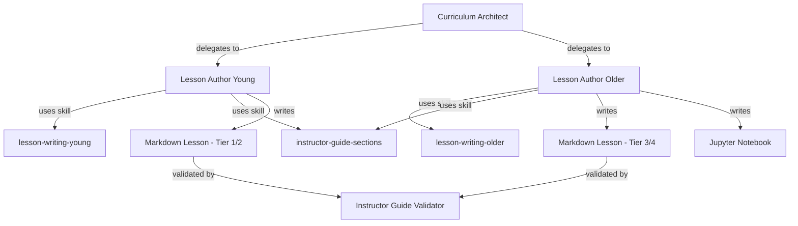
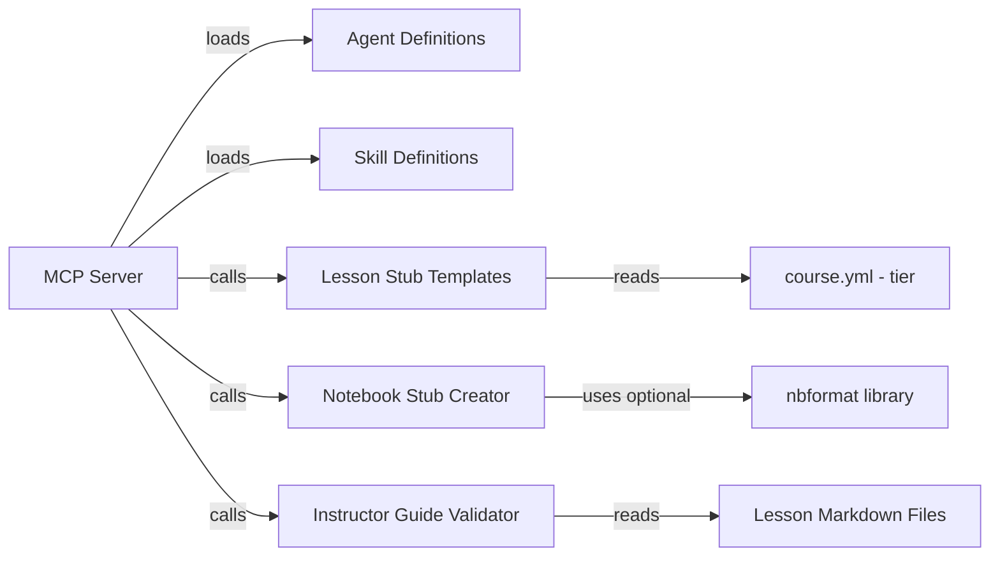
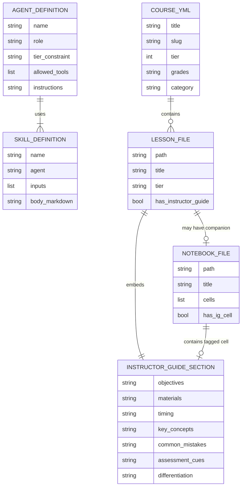

<!-- CLASI: Before changing code or making plans, review the SE process in CLAUDE.md -->

# Architecture

## Architecture Overview

Sprint 004 adds the content authoring layer to Curik. Two new agent definitions
and three content skills teach the system how to write lesson content
appropriate to each curriculum tier. A validation module enforces that every
lesson includes all required instructor guide fields. Notebook support extends
the existing stub system to Jupyter `.ipynb` files.

## Technology Stack

- **Python >=3.10** — all new code is Python, consistent with the existing
  codebase.
- **nbformat** (optional dependency) — used to create valid Jupyter notebooks.
  If unavailable, a minimal JSON template is written directly to avoid a hard
  dependency for projects that do not use notebooks.
- **YAML** — agent definitions are YAML files (parsed with `yaml.safe_load`
  from the standard `pyyaml` dependency already used for `course.yml`).
- **Markdown** — skill definitions are Markdown files with YAML frontmatter.
- **re (stdlib)** — instructor guide validation uses regex to locate `
`
  sections and field headings.

## Component Design

### Component: Lesson Author Young Agent Definition

**Purpose**: Provides the agent identity, role boundaries, and tool allowlist
for writing Tier 1-2 lessons where the instructor guide is the primary content.

**Boundary**: Inside — agent YAML file with name, role description, tier
constraint, allowed MCP tools, and behavioral instructions. Outside — the
agent runtime (Claude Code), the MCP server, and the actual lesson files.

**Use Cases**: SUC-001

The Curriculum Architect delegates to this agent by name. The agent definition
constrains behavior: only Tier 1-2 courses, only physical/hands-on activities,
instructor guide is the primary deliverable. The agent calls
`get_skill_definition("lesson-writing-young")` to load its writing
instructions and `get_skill_definition("instructor-guide-sections")` to load
the field requirements.

### Component: Lesson Author Older Agent Definition

**Purpose**: Provides the agent identity, role boundaries, and tool allowlist
for writing Tier 3-4 lessons with student-facing Markdown and Jupyter
notebooks.

**Boundary**: Inside — agent YAML file with name, role description, tier
constraint, allowed MCP tools, and behavioral instructions. Outside — the
agent runtime, the MCP server, and the actual lesson files.

**Use Cases**: SUC-002

Same delegation pattern as Lesson Author Young, but this agent targets Tiers
3-4. It produces both Markdown lesson files and Jupyter notebooks. The
instructor guide is supplementary (inline in the Markdown, tagged cells in the
notebook). The agent calls `get_skill_definition("lesson-writing-older")` and
`get_skill_definition("instructor-guide-sections")`.

### Component: Content Skills

**Purpose**: Provide step-by-step authoring instructions that agents follow
when writing lesson content.

**Boundary**: Inside — three Markdown files in `.course/skills/`:
`lesson-writing-young.md`, `lesson-writing-older.md`,
`instructor-guide-sections.md`. Outside — the agent runtime that interprets
them.

**Use Cases**: SUC-001, SUC-002, SUC-003

Each skill file has YAML frontmatter (`name`, `agent`, `inputs`) and a
Markdown body with numbered steps. The `instructor-guide-sections` skill is
shared by both agents and defines the 7 required fields, their purpose, and
examples of good vs. bad content for each.

### Component: Lesson Stub Templates

**Purpose**: Generate tier-appropriate lesson stub files with the correct
structure and instructor guide placeholders.

**Boundary**: Inside — Python string templates in `curik/templates/` module,
one per tier. Outside — the `create_lesson_stub` MCP tool that calls them,
and the lesson files they produce.

**Use Cases**: SUC-001, SUC-002

Templates are selected by the `tier` value in `course.yml`. Each template
includes:

- **Tier 1**: Instructor guide only. No student-facing content section. The
  `
` wraps the entire lesson body.
- **Tier 2**: Brief student-facing section (links to external platforms) plus
  a full instructor guide `
`.
- **Tier 3**: Student-facing Markdown with code examples, plus inline
  instructor guide `
`. Companion `.ipynb` notebook stub.
- **Tier 4**: Student-facing reference material, project spec section, plus
  inline instructor guide `
`. Companion `.ipynb` notebook stub.

### Component: Instructor Guide Validator

**Purpose**: Check that a lesson file contains all 7 required instructor guide
fields with non-empty, non-placeholder content.

**Boundary**: Inside — a pure function in `curik/validation.py` that reads a
file and returns structured results. Outside — the MCP tool that exposes it,
and the lesson files it reads.

**Use Cases**: SUC-003

The validator:
1. Opens the Markdown file and finds all `
`
   blocks (using regex to match opening and closing tags).
2. Within each block, searches for the 7 required field headings (as `###`
   subheadings): Objectives, Materials, Timing, Key Concepts, Common Mistakes,
   Assessment Cues, Differentiation.
3. For each heading, extracts the content between it and the next heading (or
   end of `
`).
4. Flags missing headings and headings with empty/placeholder content ("TBD",
   whitespace-only).
5. Returns `{"valid": bool, "errors": [{"field": str, "message": str}], "file": str}`.

### Component: Notebook Stub Creator

**Purpose**: Generate a valid Jupyter notebook file with starter structure and
an instructor guide cell.

**Boundary**: Inside — a function in `curik/templates/notebook.py` that
produces `.ipynb` content. Outside — the MCP tool that calls it, and the
notebook files it creates.

**Use Cases**: SUC-002

The creator builds a notebook with:
- A title Markdown cell.
- One or more instruction/exercise Markdown cells.
- A starter code cell.
- An instructor guide Markdown cell with metadata tag
  `{"tags": ["instructor-guide"]}` containing the 7 field headings as
  placeholders.

Uses `nbformat.v4` if available; otherwise writes a minimal valid JSON
structure directly.

## Dependency Map

- MCP Server --> Agent Definitions: reads YAML, returns via `get_agent_definition`
- MCP Server --> Skill Definitions: reads Markdown, returns via `get_skill_definition`
- MCP Server --> Lesson Stub Templates: calls `create_lesson_stub(tier, path)`
- MCP Server --> Notebook Stub Creator: calls `create_notebook_stub(path, title)`
- MCP Server --> Instructor Guide Validator: calls `validate_instructor_guide(path)`
- Lesson Stub Templates --> course.yml: reads tier to select template
- Notebook Stub Creator --> nbformat: optional; fallback to raw JSON

## Data Model

## Security Considerations

- Agent definitions are read-only files. Agents cannot modify their own
  definitions or other agents' definitions through MCP tools.
- Skill definitions are read-only. The MCP server serves them but does not
  expose a write tool.
- No secrets or credentials are involved in content authoring.
- Instructor guide content is intended for instructors only. The `
` tag
  with a specific class enables CSS-based hiding in the published site, but
  this is a UI concern outside Curik's scope. Curik does not provide
  authentication or access control for instructor content.

## Design Rationale

**Inline instructor guide via `
` tags vs. separate files**: We use inline
`
` sections rather than separate
instructor guide files. This keeps the instructor guide co-located with the
lesson content it describes, reducing drift. The `markdown` attribute ensures
MkDocs processes Markdown inside the `
`. The alternative (separate
`.instructor.md` files) was rejected because it doubles the file count and
makes it easy to update a lesson without updating its guide.

**Two agents vs. one parameterized agent**: Separate agent definitions for
Young and Older tiers rather than one agent with a tier parameter. The
behavioral differences are substantial — Tier 1 lessons are entirely
instructor-guide-driven with physical activities, while Tier 3-4 lessons are
student-facing with code and notebooks. A single agent definition would need
complex conditional instructions. Two focused definitions are simpler and less
error-prone.

**Optional nbformat dependency**: Rather than requiring `nbformat` for all
Curik installations, we make it optional. Tier 1-2 courses never produce
notebooks. The fallback (writing raw JSON) produces valid notebooks for the
simple starter structure we need. This avoids forcing an extra dependency on
users who only author young-tier courses.

**7 required fields as a fixed set**: The 7 instructor guide fields (Objectives,
Materials, Timing, Key Concepts, Common Mistakes, Assessment Cues,
Differentiation) are hardcoded in the validator rather than configurable. These
fields represent the League's pedagogical requirements and should not vary per
course. If future needs require field customization, the validator can be
extended, but starting with a fixed set keeps validation simple and reliable.

## Open Questions

- Should the notebook instructor guide cell be hidden by default in nbviewer /
  JupyterHub, or is the metadata tag sufficient for downstream tooling to
  filter it?
- Should `validate_instructor_guide` also check notebooks, or only Markdown
  files? (Current design: Markdown only. Notebook IG cells are optional
  supplements.)
- Is `pyyaml` already a project dependency, or does it need to be added for
  agent definition parsing?

## Sprint Changes

Changes planned for Sprint 004.

### Changed Components

**Added: `curik/agents/` directory**
- `lesson-author-young.yml` — agent definition for Tiers 1-2
- `lesson-author-older.yml` — agent definition for Tiers 3-4

**Added: `curik/skills/` directory**
- `lesson-writing-young.md` — content skill for young-tier lessons
- `lesson-writing-older.md` — content skill for older-tier lessons
- `instructor-guide-sections.md` — shared skill defining the 7 required fields

**Added: `curik/templates/` module**
- `lesson_stubs.py` — tier-specific Markdown lesson stub templates
- `notebook.py` — Jupyter notebook stub creator

**Added: `curik/validation.py`**
- `validate_instructor_guide(path)` — checks 7 required fields in instructor
  guide `
` sections

**Modified: MCP Server (`curik/cli.py` or new `curik/mcp.py`)**
- New tools: `create_notebook_stub`, `validate_instructor_guide`
- Extended: `get_agent_definition` and `get_skill_definition` to serve the new
  agent and skill files

**Added: `tests/`**
- `test_lesson_stubs.py` — template rendering tests per tier
- `test_notebook.py` — notebook creation and validity tests
- `test_validation.py` — instructor guide validation tests
- `test_agents_skills.py` — agent/skill definition loading tests

### Migration Concerns

None. This sprint adds new files and functions without modifying existing data
structures. Courses created before this sprint will not have agent or skill
files in their `.course/` directory; `curik init` should be extended (or a
migration note added) to copy the new agent/skill definitions into existing
course repos.
