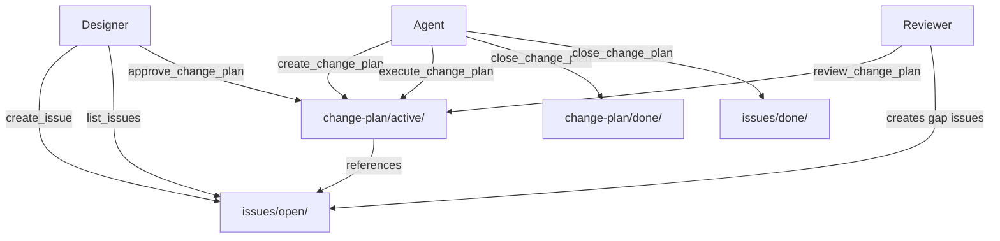
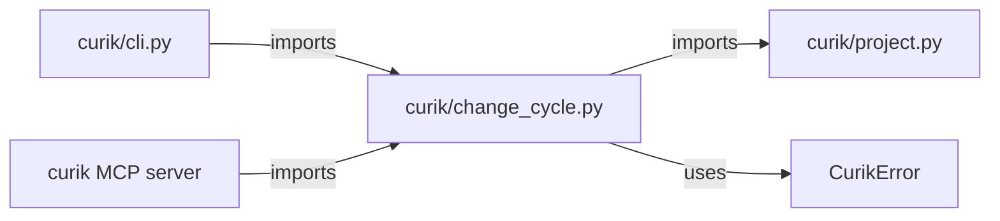

<!-- CLASI: Before changing code or making plans, review the SE process in CLAUDE.md -->

# Architecture

## Architecture Overview

Sprint 005 adds the change cycle subsystem to Curik. This subsystem manages
the iterative improvement loop after initial course drafting: filing issues,
collecting them into change plans, gating execution on human approval, enforcing
execution ordering, reviewing results, and archiving completed work.

All state lives in the `.course/` directory as Markdown files with YAML
frontmatter. The subsystem introduces one new Python module
(`curik/change_cycle.py`) that provides seven public functions, each exposed as
both a CLI subcommand and an MCP tool.



## Technology Stack

- **Language:** Python >=3.10 (consistent with existing codebase)
- **State format:** Markdown with YAML frontmatter, parsed with a simple
  frontmatter parser (no external dependency -- use the `---` delimiter
  convention already standard in the project)
- **File I/O:** `pathlib.Path` (consistent with `project.py`)
- **Errors:** `CurikError` from `curik.project` for all validation failures
- **Testing:** `unittest` with `tempfile.TemporaryDirectory` fixtures

No new external dependencies are introduced.

## Component Design

### Component: Issue Manager

**Purpose**: Create, list, and transition issue files between open and done states.

**Boundary**: Inside -- issue file creation, numbering, frontmatter parsing,
status filtering, file moves. Outside -- the content of the issue (free-form
Markdown body written by the designer).

**Use Cases**: SUC-001, SUC-003

Key functions:
- `create_issue(root, title, description, category, priority)` -- writes a new
  numbered file to `issues/open/`.
- `list_issues(root, status)` -- scans `issues/open/` and/or `issues/done/`,
  parses frontmatter, returns a list of issue summaries.
- Internal `_move_issue_to_done(root, issue_number)` -- called by
  `close_change_plan` to relocate resolved issues.

### Component: Change Plan Manager

**Purpose**: Manage the lifecycle of change plans from creation through closure.

**Boundary**: Inside -- plan file creation, approval recording, execution step
tracking with ordering enforcement, review recording, file moves to done.
Outside -- the actual file modifications performed during execution (the agent
does those directly).

**Use Cases**: SUC-001, SUC-002, SUC-003

Key functions:
- `create_change_plan(root, title, issue_numbers)` -- reads referenced issues,
  builds an ordered step list, writes plan to `change-plan/active/`.
- `approve_change_plan(root, plan_number, approver)` -- sets approval metadata.
- `execute_change_plan(root, plan_number, step_index)` -- marks a step done
  with ordering enforcement.
- `review_change_plan(root, plan_number, result, gaps)` -- records review,
  creates gap issues on failure.
- `close_change_plan(root, plan_number)` -- moves plan and resolved issues to
  done directories.

### Component: Status Tracker

**Purpose**: Provide a consolidated view of all open issues and active change plans.

**Boundary**: Inside -- aggregation of issue and plan states into a summary
structure. Outside -- presentation formatting (handled by the skill definition).

**Use Cases**: SUC-001, SUC-002, SUC-003

Key function:
- `get_change_status(root)` -- returns counts and lists of open issues, active
  plans by phase (draft/approved/executed/reviewed), and done plans.

## Dependency Map



- `change_cycle.py` depends on `project.py` for `CurikError` and `_course_dir`.
- `cli.py` imports change cycle functions to register CLI subcommands.
- The MCP server imports change cycle functions to register MCP tools.

## Data Model

### Issue File Format

Location: `.course/issues/open/NNN.md` or `.course/issues/done/NNN.md`

```yaml
---
number: 1
title: "Fix missing learning objectives in Module 3"
status: open          # open | resolved
category: content     # structural | content | syl
priority: high        # high | medium | low
created: "2026-03-11T10:00:00Z"
resolved: null        # timestamp when moved to done
plan_ref: null        # plan number that resolved this issue
---

Detailed description of the issue goes here as free-form Markdown.
```

### Change Plan File Format

Location: `.course/change-plan/active/NNN.md` or `.course/change-plan/done/NNN.md`

```yaml
---
number: 1
title: "Module 3 content fixes"
status: draft         # draft | approved | executed | reviewed | closed
issues: [1, 3, 5]    # issue numbers addressed by this plan
approved_by: null     # approver name
approved_at: null     # approval timestamp
reviewed_result: null # passed | failed
reviewed_at: null     # review timestamp
created: "2026-03-11T10:30:00Z"
steps:
  - type: structural
    description: "Move lesson-05 before lesson-04 in module-03"
    source_issue: 3
    status: pending   # pending | done
    completed_at: null
  - type: content
    description: "Add learning objectives to lesson-03-01"
    source_issue: 1
    status: pending
    completed_at: null
  - type: syl
    description: "Regenerate syllabus.yaml after structural changes"
    source_issue: null
    status: pending
    completed_at: null
---

## Change Plan: Module 3 content fixes

### Context
(Agent-generated summary of the issues being addressed.)

### Steps
(Detailed description of each step, auto-generated from the steps list above.)
```

### State Transitions

```mermaid
stateDiagram-v2
    direction LR

    state "Issue" {
        [*] --> open: create_issue
        open --> resolved: close_change_plan
    }

    state "Change Plan" {
        [*] --> draft: create_change_plan
        draft --> approved: approve_change_plan
        approved --> executed: execute_change_plan (all steps done)
        executed --> reviewed: review_change_plan (passed)
        executed --> executed: review_change_plan (failed, gaps filed)
        reviewed --> closed: close_change_plan
    }
```

### Auto-Numbering

Issue and plan numbers are auto-incremented by scanning both the `open/`/`active/`
and `done/` directories. The next number is `max(existing_numbers) + 1`, or `1`
if no files exist. File names are zero-padded to three digits: `001.md`,
`002.md`, etc.

## Security Considerations

- **Approval gate**: `execute_change_plan` checks the `approved_by` field in
  frontmatter. If null or missing, execution is blocked with a `CurikError`.
  This prevents agents from bypassing human approval.
- **No remote calls**: All operations are local file I/O. No network access,
  no credentials.
- **File path safety**: All paths are constructed via `pathlib.Path` relative to
  the course root. No user-supplied paths are used directly to prevent path
  traversal.

## Design Rationale

**File-based state over database**: Consistent with the existing Curik design
and the lesson learned from CLASI (SQLite state degraded silently). Markdown
with YAML frontmatter is human-readable, diffable, and version-controllable.

**Execution ordering enforcement**: Structural changes (moving files, renaming
directories) must complete before content changes because content changes
reference file paths. Syl regeneration must come last because it reads directory
structure. Enforcing this in the tool prevents agents from executing out of
order and producing broken references.

**Gap issues as new issues**: When a review finds gaps, they become new issues
rather than reopening the plan. This keeps the change cycle clean -- each plan
addresses a fixed set of issues, and new problems enter the next cycle. It also
provides an audit trail.

**Separate module**: `change_cycle.py` is a new module rather than additions to
`project.py` because the change cycle is a distinct subsystem with its own
state management. `project.py` handles course initialization and phase
management; `change_cycle.py` handles iterative improvement. They share
`CurikError` and `_course_dir` but are otherwise independent.

## Open Questions

- Should `close_change_plan` require all referenced issues to be resolved, or
  allow partial closure (some issues deferred to a future plan)?
- Should there be a maximum number of steps per change plan to keep plans
  focused and reviewable?
- Should `execute_change_plan` support undoing a step (marking it back to
  pending), or is that out of scope for this sprint?

## Sprint Changes

Changes planned for this sprint:

### Changed Components

**Added: `curik/change_cycle.py`**
New module containing all seven change cycle functions plus internal helpers
for file numbering, frontmatter parsing/writing, and issue movement.

**Modified: `curik/cli.py`**
Add seven new CLI subcommands: `create-issue`, `list-issues`,
`create-change-plan`, `approve-change-plan`, `execute-change-plan`,
`review-change-plan`, `close-change-plan`, and `get-change-status`.

**Modified: MCP server registration**
Register seven new MCP tools corresponding to the change cycle functions,
plus `get_change_status` for the status-tracking skill.

**Added: `tests/test_change_cycle.py`**
Unit and integration tests for all change cycle functions.

**Added: Status-tracking skill definition**
Skill file for the `status-tracking` skill that uses `get_change_status`.

### Migration Concerns

None. The `.course/issues/` and `.course/change-plan/` directories are already
created by `init_course` in `project.py`. Existing initialized courses will
have the correct directory structure. No data migration is needed.
