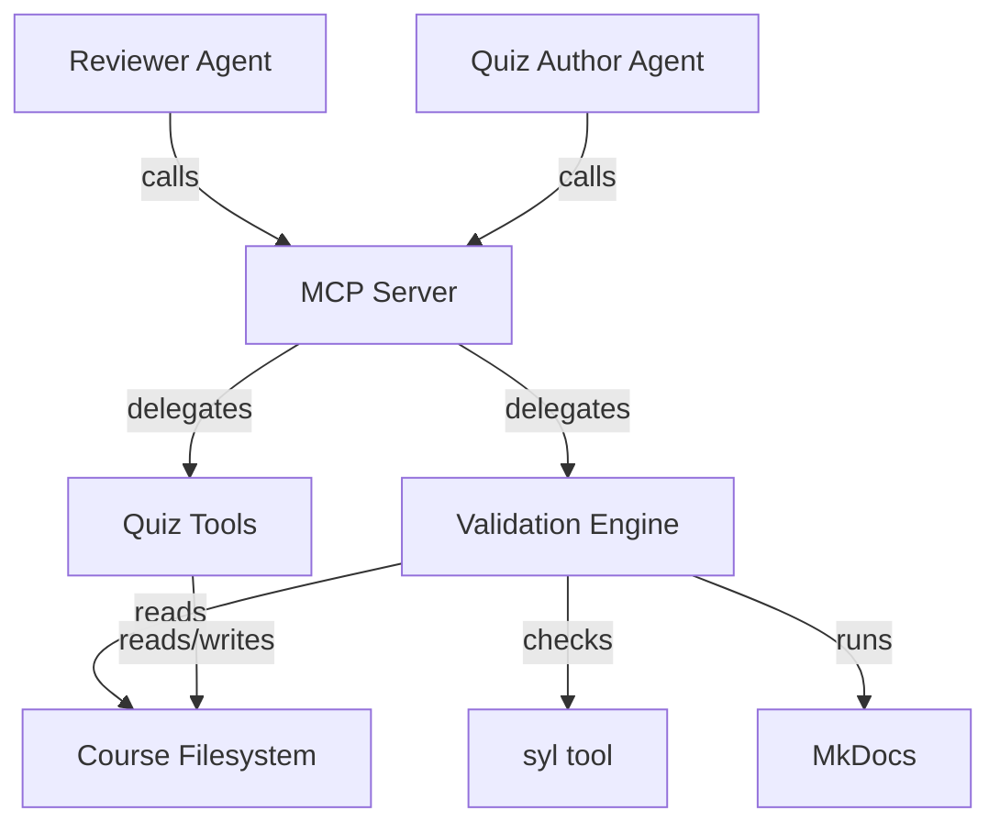
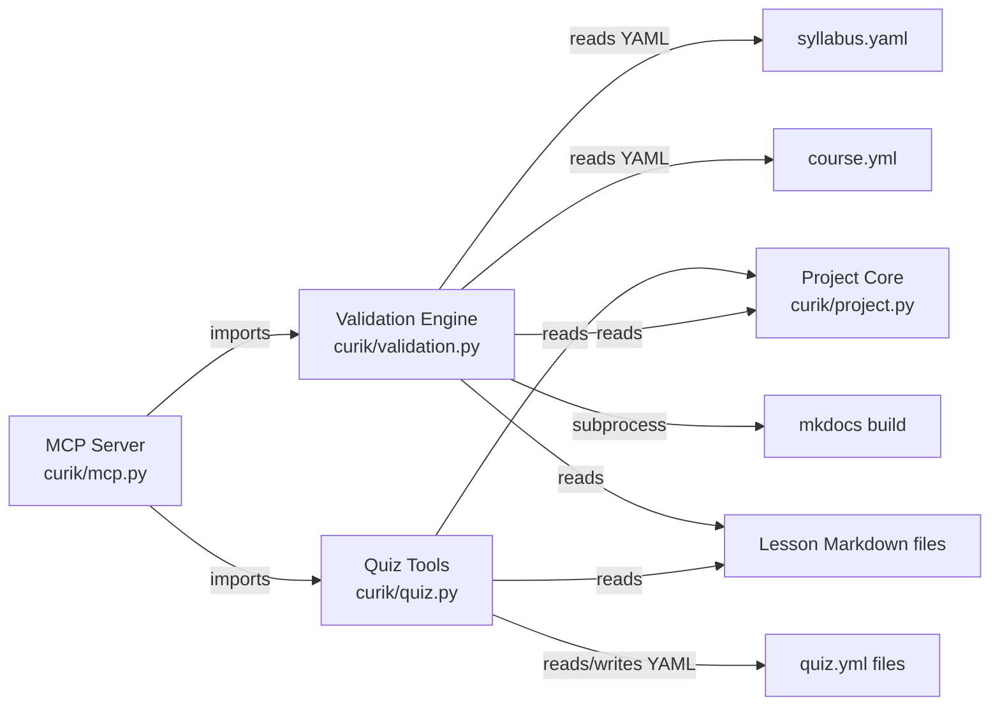
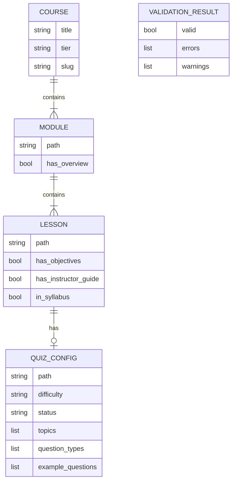

<!-- CLASI: Before changing code or making plans, review the SE process in CLAUDE.md -->

# Architecture

## Architecture Overview

Sprint 006 adds two new modules to the Curik package (`curik/validation.py`
and `curik/quiz.py`), two new agent definitions, and two new skill
definitions. The validation engine is a three-level hierarchy: lesson
validation feeds into module validation, which feeds into course validation.
Quiz authoring tools operate alongside validation, generating and checking
`quiz.yml` files per lesson. The Reviewer agent orchestrates validation; the
Quiz Author agent handles quiz configuration.



## Technology Stack

- **Language:** Python >=3.10 (project constraint)
- **Testing:** unittest with fixture directories
- **MCP:** Python MCP SDK (existing server extended with new tools)
- **External tools:** `syl` for syllabus generation, `mkdocs` for build
  validation (invoked as subprocess)
- **Data format:** YAML for `quiz.yml` and `syllabus.yaml`, JSON for
  validation results, Markdown for lesson content

PyYAML is already an implicit dependency through MkDocs; it will be used
directly for reading `quiz.yml` and `syllabus.yaml`.

## Component Design

### Component: Validation Engine

**Purpose**: Mechanically verify that curriculum content is structurally
complete at lesson, module, and course level.

**Boundary**: Inside -- reading and checking lesson files, instructor guide
sections, objectives, syllabus references, `course.yml` completeness, MkDocs
build status. Outside -- fixing validation errors (report only), quiz content
validation, content quality assessment.

**Use Cases**: SUC-006-001, SUC-006-003

The validation engine is implemented as pure functions in `curik/validation.py`:

- `validate_lesson(root: Path, lesson_path: str) -> ValidationResult`
  - Reads the lesson Markdown file
  - Checks for required instructor guide sections: Overview, Materials,
    Preparation, Lesson Plan, Assessment Notes, Differentiation
  - Checks for a Learning Objectives section with at least one list item
  - Reads `syllabus.yaml` and verifies the lesson path appears in it
  - Returns `{"valid": bool, "errors": list[str], "warnings": list[str]}`

- `validate_module(root: Path, module_path: str) -> ValidationResult`
  - Reads the module directory
  - Checks that a module overview file (`index.md` or `overview.md`) exists
  - Calls `validate_lesson` for each lesson in the module
  - Aggregates results; module is invalid if any lesson is invalid or overview
    is missing

- `validate_course(root: Path) -> CourseValidationResult`
  - Calls `validate_module` for each module directory
  - Checks `course.yml` for TBD placeholder values
  - Runs `mkdocs build --strict` as a subprocess and captures exit code
  - Compares `syllabus.yaml` entries against actual directory contents
  - Returns aggregated result with per-module and per-lesson detail

- `get_validation_report(root: Path) -> dict`
  - Calls `validate_course` and formats the full report as a structured dict
    suitable for JSON serialization

Tier-aware validation: The tier (read from `course.yml`) determines which
checks apply. Tier 1 lessons require instructor guide sections but not
student-facing Markdown. Tier 3-4 lessons require both instructor guide and
student content.

### Component: Quiz Tools

**Purpose**: Generate, validate, and manage quiz configuration files that
align with lesson learning objectives.

**Boundary**: Inside -- creating `quiz.yml` stubs, checking topic-objective
alignment, managing quiz status. Outside -- quiz rendering, student
interaction, grading, question bank management.

**Use Cases**: SUC-006-002

Implemented in `curik/quiz.py`:

- `generate_quiz_stub(root: Path, lesson_path: str) -> Path`
  - Reads the lesson file and extracts learning objectives
  - Creates `quiz.yml` in the lesson directory with schema:
    ```yaml
    topics:
      - name: "Topic derived from objective 1"
        objective: "Original objective text"
      - name: "Topic derived from objective 2"
        objective: "Original objective text"
    difficulty: medium
    question_types:
      - multiple_choice
      - short_answer
    example_questions: []
    status: draft
    ```
  - Returns the path to the created file
  - Raises `CurikError` if no objectives found in the lesson

- `validate_quiz_alignment(root: Path, lesson_path: str) -> ValidationResult`
  - Reads the lesson's learning objectives
  - Reads `quiz.yml` from the lesson directory
  - Checks that every objective is covered by at least one quiz topic
    (matching by the `objective` field in each topic entry)
  - Reports uncovered objectives as errors

- `set_quiz_status(root: Path, lesson_path: str, status: str) -> None`
  - Valid statuses: `draft`, `review`, `approved`
  - Updates the `status` field in `quiz.yml`
  - Raises `CurikError` for invalid status values

### Component: Reviewer Agent

**Purpose**: Run validation across the course and produce actionable reports
for the Curriculum Architect.

**Boundary**: Inside -- invoking validation tools, interpreting results,
filing issues for failures. Outside -- fixing content, authoring lessons,
making architectural decisions.

**Use Cases**: SUC-006-001, SUC-006-003

Agent definition in `.course/agents/reviewer.md`:
- **Role**: Quality gate agent that validates curriculum completeness
- **Tools**: `validate_lesson`, `validate_module`, `validate_course`,
  `get_validation_report`, `create_issue` (from Sprint 5)
- **Constraints**: Read-only access to lesson content. Cannot modify lessons
  or quiz files. Can only create issues to report problems.

### Component: Quiz Author Agent

**Purpose**: Create quiz configuration files aligned to lesson learning
objectives.

**Boundary**: Inside -- generating quiz stubs, editing `quiz.yml`, checking
alignment. Outside -- writing quiz questions for student consumption,
grading, lesson content authoring.

**Use Cases**: SUC-006-002

Agent definition in `.course/agents/quiz-author.md`:
- **Role**: Creates and maintains `quiz.yml` files for each lesson
- **Tools**: `generate_quiz_stub`, `validate_quiz_alignment`,
  `set_quiz_status`, `validate_lesson` (to confirm objectives exist first)
- **Constraints**: Can only write to `quiz.yml` files. Cannot modify lesson
  content or course structure.

### Component: Skills

**Purpose**: Provide step-by-step guidance for validation and quiz authoring
workflows.

**Boundary**: Inside -- skill step definitions, tool references, agent
assignments. Outside -- tool implementation.

Two skill definitions:

- **`validation-checklist`** (`.course/skills/validation-checklist.md`):
  Steps for running a full validation pass -- validate lessons, validate
  modules, validate course, interpret report, file issues for failures.
  Used by the Reviewer agent.

- **`quiz-authoring`** (`.course/skills/quiz-authoring.md`):
  Steps for creating quiz configuration -- confirm lesson has objectives,
  generate stub, refine topics, validate alignment, set status. Used by
  the Quiz Author agent.

## Dependency Map



## Data Model



**quiz.yml schema:**

```yaml
topics:
  - name: string        # Short topic label
    objective: string   # The lesson objective this topic covers
difficulty: string      # "easy" | "medium" | "hard"
question_types:         # List of allowed question types
  - multiple_choice
  - short_answer
  - true_false
  - code_completion
example_questions: []   # Optional list of example questions
status: string          # "draft" | "review" | "approved"
```

**ValidationResult schema (Python dict / JSON):**

```json
{
  "valid": false,
  "errors": ["Instructor guide section 'Materials' is missing"],
  "warnings": ["No example questions in quiz.yml"]
}
```

## Security Considerations

No new security concerns. All tools operate on the local filesystem within
the course directory. The `mkdocs build` subprocess is invoked with the
course root as the working directory. No network access, no credentials,
no user data beyond course content.

## Design Rationale

**Three-level validation hierarchy (lesson -> module -> course):**
Considered flat validation (check everything at once) vs hierarchical.
Hierarchical was chosen because it enables targeted re-validation after
fixing a single lesson, provides clear error attribution (you know which
lesson failed and why), and mirrors the course structure that authors
already understand.

**quiz.yml per lesson (not per module or per course):**
Placing quiz configuration at the lesson level keeps topics tightly coupled
to the lesson's learning objectives. A module-level or course-level quiz
file would require cross-referencing objectives across multiple files,
making alignment validation more complex and error-prone.

**Objective-based alignment checking:**
The `validate_quiz_alignment` tool checks that each lesson objective has a
corresponding quiz topic by matching the `objective` field in each topic
entry. This is a string equality check, not semantic similarity. This was
chosen for determinism -- the Quiz Author copies objective text into the
topic entry, making alignment explicit and verifiable without NLP.

**Reviewer agent is read-only:**
The Reviewer can validate and report but cannot fix. This separation of
concerns prevents a single agent from both judging and modifying content,
which would undermine the review process. Fixes go through the change cycle
(Sprint 5 tooling).

## Open Questions

- Should `validate_course` actually invoke `mkdocs build`, or just check for
  the presence of `mkdocs.yml`? Running the build is more thorough but adds
  a subprocess dependency and slows validation. A flag parameter
  (`include_build_check=True`) could make this optional.
- Should quiz alignment validation allow fuzzy matching (objective text is
  similar but not identical to topic objective), or require exact string
  match? Exact match is simpler and deterministic but brittle if objectives
  are edited after quiz creation.
- Should `validate_lesson` checks vary by tier at the field level (e.g.,
  Tier 1 does not require student-facing content sections), or should tier
  differences only affect which lessons are expected to exist?

## Sprint Changes

Changes planned.

### Changed Components

**Added: `curik/validation.py`**
New module containing `validate_lesson`, `validate_module`,
`validate_course`, and `get_validation_report` functions. Pure functions
that read the filesystem and return structured validation results.

**Added: `curik/quiz.py`**
New module containing `generate_quiz_stub`, `validate_quiz_alignment`, and
`set_quiz_status` functions. Reads lesson files for objectives, writes and
reads `quiz.yml` files.

**Modified: `curik/mcp.py` (or MCP server entry point)**
Register seven new MCP tools: `validate_lesson`, `validate_module`,
`validate_course`, `get_validation_report`, `generate_quiz_stub`,
`validate_quiz_alignment`, `set_quiz_status`.

**Added: `.course/agents/reviewer.md`**
Reviewer agent definition with role, tools, and constraints.

**Added: `.course/agents/quiz-author.md`**
Quiz Author agent definition with role, tools, and constraints.

**Added: `.course/skills/validation-checklist.md`**
Skill definition for running a full validation pass.

**Added: `.course/skills/quiz-authoring.md`**
Skill definition for creating and validating quiz configuration.

**Added: `tests/test_validation.py`**
Unit tests for all validation functions with fixture directories.

**Added: `tests/test_quiz.py`**
Unit tests for all quiz tools with fixture directories.

### Migration Concerns

None. This sprint adds new modules and tools without modifying existing
functionality. No data migration needed. Existing courses gain access to
validation tools but are not required to use them until they choose to
run validation.
