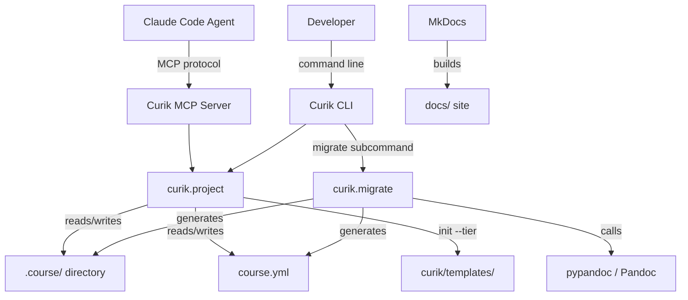
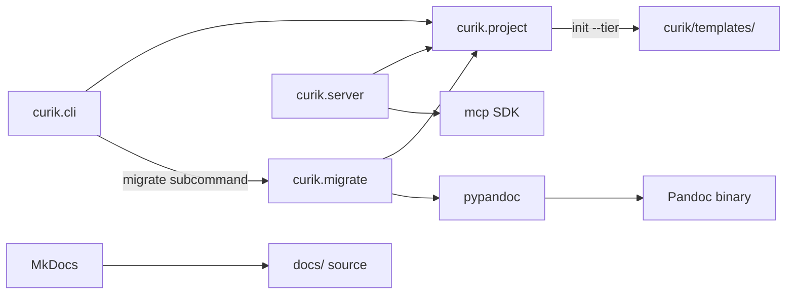
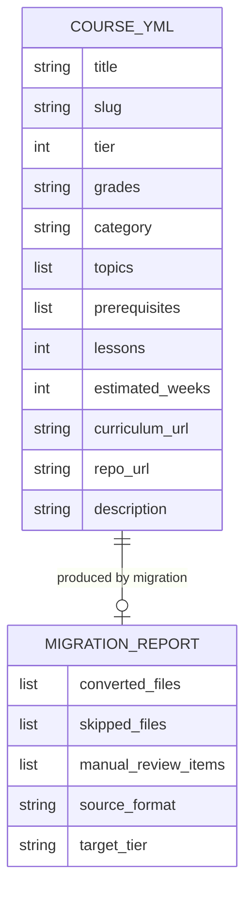

<!-- CLASI: Before changing code or making plans, review the SE process in CLAUDE.md -->

# Architecture

## Architecture Overview

Sprint 007 adds three capabilities on top of the existing Curik system:
a migration pipeline for converting legacy courses, tier-specific project
templates, and user-facing documentation. It also introduces an end-to-end
integration test that exercises the full workflow across all components.



## Technology Stack

- **Language**: Python >=3.10
- **Build**: setuptools >=68
- **CLI**: argparse (existing)
- **MCP**: `mcp` Python SDK (stdio transport)
- **State**: JSON + Markdown files in `.course/` directory
- **Testing**: unittest
- **RST conversion**: pypandoc (Python wrapper for Pandoc)
- **Documentation**: MkDocs with Material theme
- **Templates**: Plain directory trees bundled in the package via
  `package_data`

pypandoc is chosen over hand-rolled regex conversion because RST has
complex constructs (directives, roles, nested blocks) that regex cannot
handle reliably. Pandoc is the industry standard for document conversion.

## Component Design

### Component: Migration Pipeline (`curik.migrate`)

**Purpose**: Convert an existing course repository from Sphinx/RST or
unstructured Markdown into the Curik standard directory layout.

**Boundary**: Inside — format detection, RST-to-Markdown conversion,
directory restructuring, `course.yml` generation, migration report
production. Outside — Pandoc installation, source repo management,
post-migration manual edits.

**Use Cases**: SUC-002

The migration pipeline follows five stages:

1. **Inventory**: Walk the source directory, catalog all files by type
   (`.rst`, `.md`, `.py`, `.ipynb`, images, other). Detect Sphinx by
   looking for `conf.py`. Detect VuePress by looking for `.vuepress/`.
   Record the `toctree` structure if present.
2. **Template selection**: Based on detected format and any `--tier` flag,
   select the target directory template (tier 1-4).
3. **Content conversion**: Convert `.rst` files to `.md` via pypandoc.
   Copy existing `.md` files as-is. Copy images to an `assets/` directory
   alongside the lesson. Skip binary files with a warning.
4. **Structure mapping**: Map converted files into the Curik hierarchy
   (`modules/NN-name/lessons/NN-name/`). Use `toctree` ordering if
   available; otherwise alphabetical. Generate instructor guide stubs
   (`_instructor.md`) for each lesson.
5. **Metadata generation**: Extract title, author, and description from
   `conf.py` (or frontmatter) into `course.yml`. Set `tier`, `grades`,
   and other fields to TBD. Run `curik init` to create `.course/`.
   Produce a migration report as `migration-report.md` in the output
   directory.

### Component: Tier Templates (`curik/templates/`)

**Purpose**: Provide pre-configured directory skeletons for each of the
four League curriculum tiers.

**Boundary**: Inside — directory structure, stub files, tier-specific
`.devcontainer/` config (tiers 3-4), sample `mkdocs.yml`, sample
`course.yml` with tier pre-filled. Outside — actual course content.

**Use Cases**: SUC-002 (migration template selection), SUC-001 (init
with tier)

Templates are stored as plain directories:
```
curik/templates/
  tier_1/        # Instructor guide only, no student computers
  tier_2/        # Website linking to external platforms
  tier_3/        # Repo with code, notebooks, Codespaces
  tier_4/        # Reference docs, project specs
```

Each template contains:
- `course.yml` with tier pre-filled
- `mkdocs.yml` with appropriate nav structure
- `modules/01-example/lessons/01-example/` with stub files appropriate
  to the tier (e.g., tier 1 has `_instructor.md` only; tier 3 has
  `lesson.md`, `_instructor.md`, and a sample `.ipynb`)
- `.devcontainer/devcontainer.json` for tiers 3-4

### Component: Documentation Site (`docs/`)

**Purpose**: Provide user-facing documentation for Curik.

**Boundary**: Inside — Markdown source files, `mkdocs.yml` config,
navigation structure. Outside — hosting, deployment (GitHub Pages).

**Use Cases**: SUC-003

Documentation structure:
```
docs/
  index.md              # Home / overview
  installation.md       # Install guide
  quickstart.md         # Tutorial: first course in 10 minutes
  cli-reference.md      # All CLI subcommands
  mcp-reference.md      # All MCP tools with params and examples
  agents-and-skills.md  # Agent catalog and skill descriptions
  tiers/
    tier-1.md           # Tier 1 workflow guide
    tier-2.md           # Tier 2 workflow guide
    tier-3.md           # Tier 3 workflow guide
    tier-4.md           # Tier 4 workflow guide
  migration.md          # Migration guide
mkdocs.yml
```

### Component: End-to-End Test (`tests/test_e2e_workflow.py`)

**Purpose**: Verify the complete Curik workflow from init to validated
course in a single automated test.

**Boundary**: Inside — test orchestration, assertions at each phase
boundary. Outside — individual component correctness (covered by
existing unit tests).

**Use Cases**: SUC-001

The test creates a temporary directory, runs the entire workflow
programmatically through `curik.project` functions (not subprocess
calls to the CLI), and asserts the final state. This catches integration
bugs between phases that unit tests miss.

## Dependency Map



- `curik.migrate` depends on `curik.project` for `init_course()` and
  validation functions.
- `curik.migrate` depends on `pypandoc` for RST conversion.
- `pypandoc` depends on the Pandoc binary being installed on the system.
- `curik.project` reads templates from `curik/templates/` when `--tier`
  is specified.
- Documentation build depends on MkDocs + Material theme (dev dependency).

## Data Model

No new persistent entities. The migration module produces standard Curik
artifacts:

- `.course/state.json` — initialized to Phase 1
- `.course/spec.md` — stub spec with sections to fill
- `course.yml` — populated from source repo metadata where available
- `migration-report.md` — one-time artifact listing conversion results



## Security Considerations

- Migration reads from a source directory and writes to a target
  directory. Both must be local filesystem paths — no network access.
- `pypandoc` invokes Pandoc as a subprocess. Input is limited to file
  paths in the source directory — no user-supplied shell commands.
- Documentation site is static HTML with no server-side logic.
- No secrets, credentials, or authentication involved in this sprint.

## Design Rationale

**pypandoc over regex conversion**: RST directives (`.. code-block::`,
`.. toctree::`, `.. note::`, roles like `:ref:`) cannot be reliably
converted with regular expressions. Pandoc handles the full RST spec.
The tradeoff is requiring Pandoc to be installed, but this is acceptable
because migration is a one-time operation per course, not a daily
workflow.

**Templates as plain directories vs. Cookiecutter/Jinja**: Plain
directory copies are simpler to maintain, test, and debug. There is no
need for variable substitution in the template — `curik init` can
post-process `course.yml` to fill in the title and slug after copying.
This avoids a Jinja/Cookiecutter dependency for minimal benefit.

**End-to-end test via Python API, not CLI subprocess**: Testing through
the Python API is faster, produces better error messages, and avoids
flakiness from subprocess management. The CLI is a thin wrapper already
tested elsewhere — what matters is that the business logic pipeline
works end-to-end.

**Migration report as Markdown**: The migration report is for human
consumption — a curriculum designer reviewing what was converted and
what needs manual attention. Markdown renders well in GitHub and editors.

## Open Questions

- Should `curik migrate` write to the source directory in-place or to a
  separate output directory? In-place is more convenient but risks data
  loss. A separate output directory is safer. Current design assumes a
  separate output directory with a `--output` flag.
- Should tier templates include sample GitHub Actions workflows for
  registry integration, or just document the setup? Current plan is
  documentation only, with a sample workflow file in `docs/`.
- What is the minimum Pandoc version required? Need to test with the
  version available in GitHub Codespaces and common CI environments.

## Sprint Changes

Changes planned.

### Changed Components

- **Added**: `curik/migrate.py` — migration pipeline module with
  `migrate_course()` function, format detection, RST conversion,
  directory restructuring, and report generation
- **Added**: `curik/templates/tier_1/` through `curik/templates/tier_4/`
  — tier-specific project templates with stub files, `course.yml`,
  `mkdocs.yml`, and `.devcontainer/` (tiers 3-4)
- **Modified**: `curik/cli.py` — add `migrate` subcommand, add `--tier`
  flag to `init` subcommand
- **Modified**: `curik/project.py` — update `init_course()` to accept
  optional `tier` parameter and copy from templates
- **Modified**: `pyproject.toml` — add `pypandoc` dependency, add
  `mkdocs-material` as dev dependency, include `templates/` in
  `package_data`, bump version to 0.8.0
- **Added**: `docs/` — full user-facing documentation source
- **Added**: `mkdocs.yml` — documentation site configuration
- **Added**: `tests/test_e2e_workflow.py` — end-to-end integration test
- **Added**: `tests/test_migrate.py` — migration unit tests
- **Added**: `tests/test_templates.py` — template validation tests

### Migration Concerns

- Existing `curik init` behavior must remain unchanged when `--tier` is
  not specified. The tier parameter is optional with no default — omitting
  it produces the same output as before.
- The `pypandoc` dependency is added to the main package. If Pandoc is
  not installed, only the `migrate` command fails — all other Curik
  functionality works normally.
- Template directories are included in the package distribution via
  `package_data`. This increases the package size but keeps installation
  self-contained.
