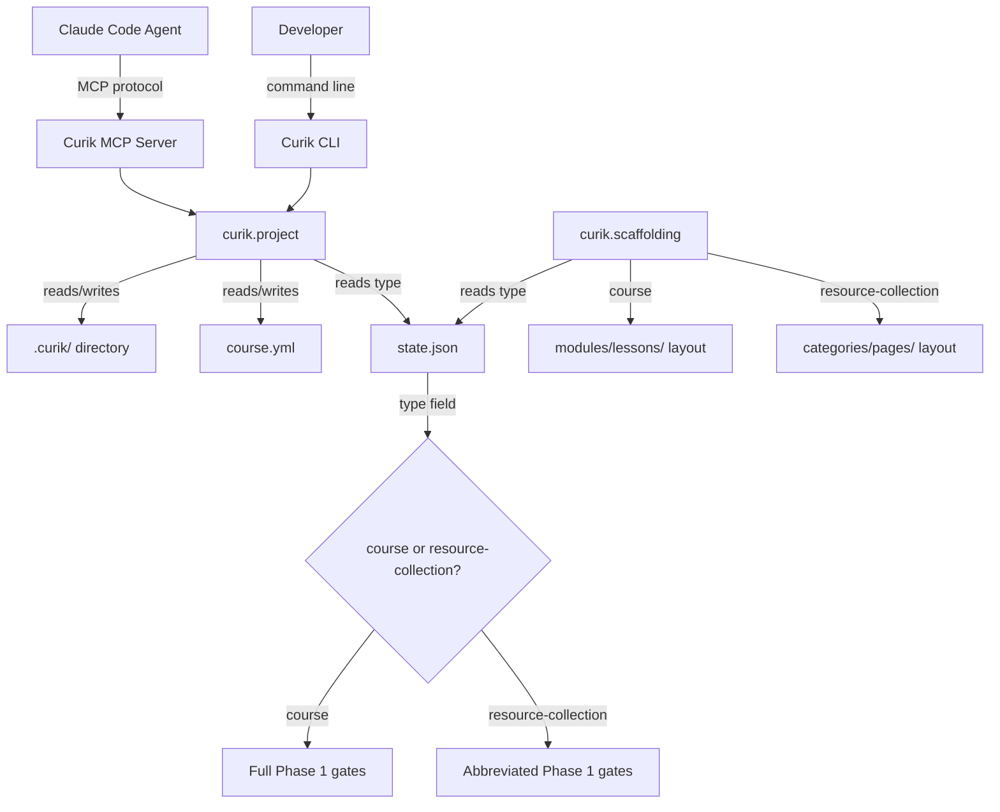
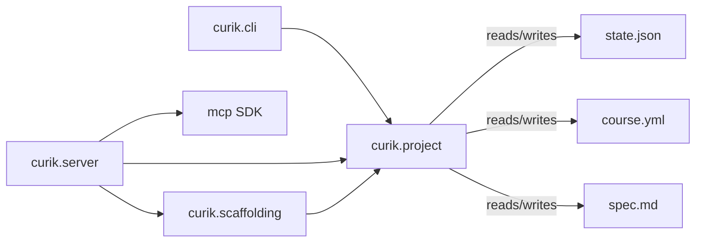
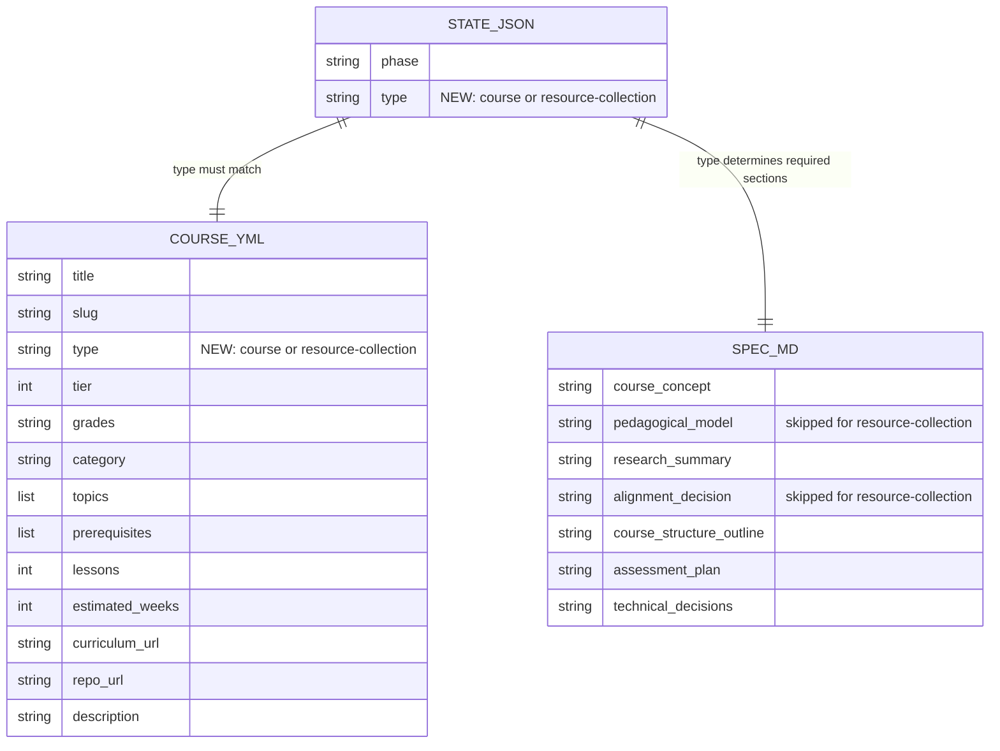

<!-- CLASI: Before changing code or making plans, review the SE process in CLAUDE.md -->

# Architecture

## Architecture Overview

Sprint 008 extends the Curik project model with a course type system. The
existing `course` type retains all current behavior. The new
`resource-collection` type provides an abbreviated Phase 1 workflow and a
different scaffolding layout. The type is stored in `state.json` and
`course.yml`, and is read by `advance_phase` and `scaffold_structure` to
adjust their behavior.

## Technology Stack

- **Language**: Python >=3.10
- **Build**: setuptools >=68
- **CLI**: argparse (existing)
- **MCP**: `mcp` Python SDK (stdio transport)
- **State**: JSON + Markdown files in `.curik/` directory
- **Testing**: unittest

No new dependencies are introduced in this sprint. All changes are to existing
modules and one new skill definition file.

## Component Design

### Component: Project Model (`curik.project`)

**Purpose**: Manage course initialization, state persistence, spec management, and phase gating.

**Boundary**: Inside — `init_course`, `_read_state`, `get_phase`, `advance_phase`, state.json format, course.yml template. Outside — CLI argument parsing, MCP transport, scaffolding layout.

**Use Cases**: SUC-001, SUC-002

Changes in this sprint:

- `init_course(root, course_type="course")` gains an optional `course_type`
  parameter. Valid values are `"course"` and `"resource-collection"`. Invalid
  values raise `CurikError`. The type is written to `state.json` as the `type`
  field and to `course.yml` as the `type:` line.
- `_read_state(root)` already returns the full state dict. Code that reads
  the type uses `state.get("type", "course")` to default missing fields to
  `"course"` for backward compatibility.
- `get_phase(root)` reads the type and adjusts the `requirements` list: for
  `resource-collection`, it excludes `pedagogical-model` and
  `alignment-decision` from the requirements.
- `advance_phase(root, target_phase)` reads the type and determines which
  spec sections must be non-placeholder. For `resource-collection`, only five
  sections are checked: `course-concept`, `research-summary`,
  `course-structure-outline`, `assessment-plan`, `technical-decisions`.

### Component: Scaffolding (`curik.scaffolding`)

**Purpose**: Create directory trees and stub files for Phase 2 content authoring.

**Boundary**: Inside — directory creation, stub file generation, structure parsing. Outside — project state management, content authoring.

**Use Cases**: SUC-003

Changes in this sprint:

- `scaffold_structure(root, structure)` accepts a structure dict that may use
  `categories`/`pages` keys (resource collections) instead of
  `modules`/`lessons` keys (courses). When `categories` is present, the
  function creates category directories and page stubs with a simpler format
  (title + content placeholder, no instructor guide div).
- The function detects which format is provided by checking for the
  `categories` key first, then falling back to `modules`. If neither is
  present, it raises `CurikError`.

### Component: MCP Server (`curik.server`)

**Purpose**: Expose Curik functions as MCP tools for Claude agent interaction.

**Boundary**: Inside — tool definitions, parameter marshaling, error handling. Outside — business logic (delegated to curik.project and curik.scaffolding).

**Use Cases**: SUC-001

Changes in this sprint:

- `tool_init_course(course_type: str = "course")` gains an optional
  `course_type` parameter and passes it through to `init_course`.

### Component: Resource Collection Spec Skill (`curik/skills/resource-collection-spec.md`)

**Purpose**: Guide designers through the abbreviated Phase 1 process for resource collections.

**Boundary**: Inside — question sequence, section list, process steps. Outside — actual spec content (produced by the designer with agent assistance).

**Use Cases**: SUC-002

This is a new skill definition file. It documents:
- Which Phase 1 sub-phases apply to resource collections (1a concept, 1c research, 1e synthesis)
- Which sub-phases are skipped (1b pedagogical model, 1d alignment)
- The question sequence for capturing resource collection concepts
- The recording process using existing `update_spec` and `record_course_concept` tools

## Dependency Map

- `curik.server` depends on `curik.project` for `init_course` and `advance_phase`.
- `curik.server` depends on `curik.scaffolding` for `scaffold_structure`.
- `curik.scaffolding` depends on `curik.project` for `CurikError` and `_course_dir`.
- `curik.project` reads and writes `state.json`, `course.yml`, and `spec.md`.
- No new external dependencies.

## Data Model

Two existing artifacts gain a `type` field:

Backward compatibility: existing `state.json` files without a `type` field are
treated as `"course"`. No migration is needed.

## Security Considerations

- No new network access, authentication, or secret handling.
- The `course_type` parameter is validated against a fixed allowlist
  (`"course"`, `"resource-collection"`). Invalid values raise `CurikError`.
- All file operations remain within the project root directory.

## Design Rationale

**Type stored in both state.json and course.yml**: `state.json` is the
authoritative source for runtime logic (phase gating, scaffolding decisions).
`course.yml` includes the type for visibility to designers and external tools
(e.g., registry systems, CI pipelines) that read project metadata but do not
parse Curik internal state. This avoids forcing external consumers to read
`.curik/state.json`.

**Abbreviated Phase 1 rather than separate workflow**: Resource collections
reuse the same Phase 1 infrastructure (spec sections, `advance_phase`, skill
definitions) with a reduced set of required gates. This avoids duplicating the
entire phase management system. The cost is a conditional check in
`advance_phase`, which is simpler than maintaining parallel code paths.

**Structure key detection (`categories` vs `modules`) in scaffold_structure**:
Rather than requiring the caller to also pass the course type, the scaffolding
function infers the format from the structure dict keys. This keeps the API
simple — the caller builds the structure dict appropriate to their course type
and the function handles it. If the caller passes `modules`, they get lesson
stubs; if they pass `categories`, they get page stubs.

**Simpler page stubs for resource collections**: Lesson stubs include an
instructor guide div because lessons are taught by instructors. Resource pages
are reference material consumed directly, so the stub contains just a title
and content placeholder.

## Open Questions

None. The design is straightforward and builds on well-established patterns
in the existing codebase.

## Sprint Changes

Changes planned.

### Changed Components

- **Modified**: `curik/project.py` — `init_course()` gains optional
  `course_type` parameter; `state.json` and `course.yml` templates include
  `type` field; `_read_state()` returns type (already returns full dict);
  `get_phase()` adjusts requirements based on type; `advance_phase()` skips
  pedagogical-model and alignment-decision checks for resource collections
- **Modified**: `curik/scaffolding.py` — `scaffold_structure()` supports
  `categories`/`pages` keys for resource collections, creates simpler page
  stubs without instructor guide div
- **Modified**: `curik/server.py` — `tool_init_course()` gains optional
  `course_type` parameter
- **Added**: `curik/skills/resource-collection-spec.md` — skill definition
  for abbreviated Phase 1 process
- **Added**: `tests/test_resource_collection.py` — unit tests for all
  resource collection behavior

### Migration Concerns

None. Existing projects without a `type` field in `state.json` default to
`"course"` behavior. No changes are needed to existing project directories.
The `course.yml` template change only affects newly initialized projects.
