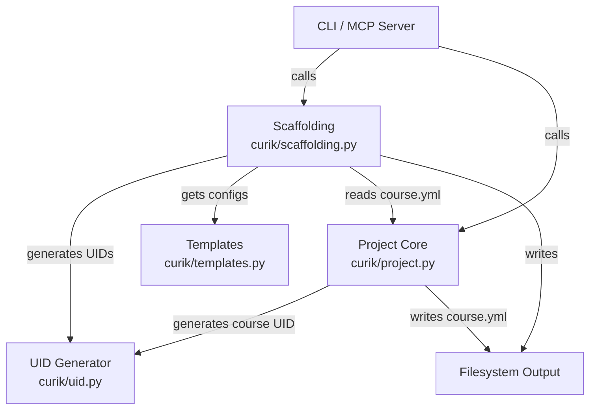
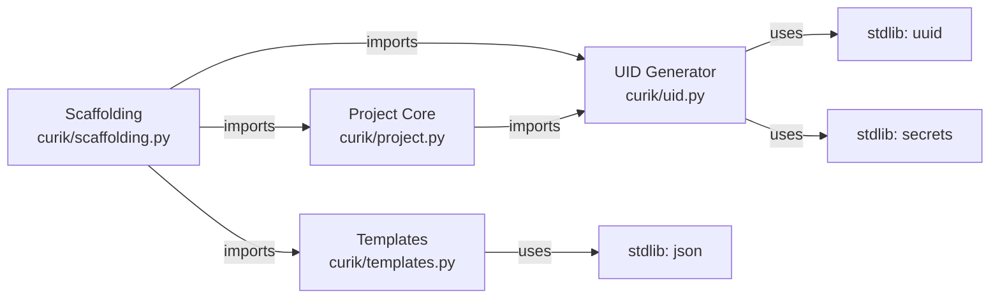
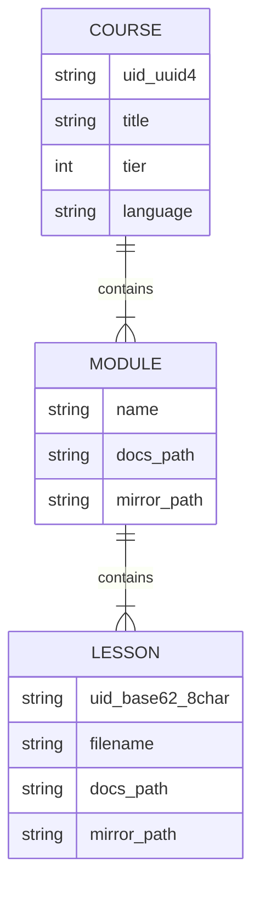

<!-- CLASI: Before changing code or making plans, review the SE process in CLAUDE.md -->

# Architecture

## Architecture Overview

Sprint 009 adds a new UID generation module (`curik/uid.py`) and enhances the
existing scaffolding pipeline (`curik/scaffolding.py`) and template system
(`curik/templates.py`) to produce richer output for Tier 3-4 courses. The UID
module is a standalone utility with no external dependencies. The scaffolding
enhancements are tier-aware: Tier 1-2 courses continue to scaffold as before
(with the addition of UIDs in frontmatter), while Tier 3-4 courses gain mirror
directories, devcontainer configs, and explicit mkdocs nav.



## Technology Stack

- **Language:** Python >=3.10 (project constraint)
- **UID generation:** `uuid` stdlib module for UUID4; `secrets` stdlib module
  for cryptographically secure random base62 strings
- **Testing:** unittest with temporary directories
- **Data format:** YAML frontmatter in Markdown files, YAML for `course.yml`
  and `mkdocs.yml`, JSON for `.devcontainer/devcontainer.json`

No new dependencies are introduced. All UID generation uses the Python
standard library.

## Component Design

### Component: UID Generator

**Purpose**: Generate unique identifiers for courses, modules, lessons, and
exercises.

**Boundary**: Inside -- UUID4 generation for courses, 8-character base62
generation for units. Outside -- UID storage, deduplication, registry
integration.

**Use Cases**: SUC-009-001, SUC-009-002

Implemented in `curik/uid.py`:

- `generate_course_uid() -> str`
  - Returns `str(uuid.uuid4())`, a standard UUID4 string
    (e.g., `"a1b2c3d4-e5f6-4a7b-8c9d-0e1f2a3b4c5d"`).
  - Used when creating `course.yml` during `init_course`.

- `generate_unit_uid(length: int = 8) -> str`
  - Uses `secrets.choice()` to select characters from `string.ascii_letters +
    string.digits` (62 characters: a-z, A-Z, 0-9).
  - Returns a string of the specified length (default 8).
  - 62^8 = 218 trillion possible values; collision probability is negligible
    for any realistic course size.
  - Used for modules, lessons, and exercises.

### Component: Scaffolding (Enhanced)

**Purpose**: Create the directory tree, stub files, and configuration files
for a course project.

**Boundary**: Inside -- directory creation, stub file generation with UIDs,
mirror directory creation, devcontainer writing, nav generation, mkdocs.yml
writing. Outside -- content authoring, validation, course publication.

**Use Cases**: SUC-009-001, SUC-009-002, SUC-009-003

Modifications to `curik/scaffolding.py`:

- **`scaffold_structure(root, structure, tier=None, language=None)`**:
  - If `tier` is not provided, reads it from `course.yml` in the root
    directory. Falls back to Tier 1 behavior if `course.yml` is absent or
    tier is not set.
  - For every lesson stub created, calls `generate_unit_uid()` and writes
    YAML frontmatter (`---\nuid: <value>\n---\n`) before the lesson content.
  - For Tier 3-4: after creating `docs/docs/<module>/` directories, creates
    corresponding `lessons/<module>/` directories at the repo root. Creates
    a `projects/` directory at the repo root.
  - For Tier 3-4: calls `get_devcontainer_json(language)` and writes
    `.devcontainer/devcontainer.json`.
  - Calls `generate_nav(structure)` and passes the result to
    `get_mkdocs_yml(title, tier, nav=nav)`. Writes the output to
    `docs/mkdocs.yml`.

- **`create_lesson_stub(root, module, lesson, tier, uid=None)`**:
  - Accepts an optional `uid` parameter. If not provided, calls
    `generate_unit_uid()`.
  - Writes YAML frontmatter with the UID at the top of the stub file,
    before the existing tier-appropriate content.

- **`generate_nav(structure) -> list[dict]`** (new function):
  - Takes a structure dict (`{"modules": [{"name": "01-intro", "lessons":
    ["01-hello.md", ...]}]}`).
  - Returns a nav list in MkDocs format:
    ```python
    [
        {"Home": "index.md"},
        {"Intro": [
            {"Hello": "01-intro/01-hello.md"},
            {"Variables": "01-intro/02-variables.md"},
        ]},
    ]
    ```
  - Module and lesson titles are derived using the existing
    `_title_from_filename()` helper.

### Component: Templates (Enhanced)

**Purpose**: Provide reusable configuration templates for course scaffolding.

**Boundary**: Inside -- mkdocs.yml generation, devcontainer.json generation,
course.yml template generation. Outside -- file I/O (caller writes the
output).

**Use Cases**: SUC-009-001, SUC-009-003

Modifications to `curik/templates.py`:

- **`get_mkdocs_yml(title, tier, nav=None)`**:
  - Gains an optional `nav` parameter (a list of dicts).
  - When `nav` is provided, appends a `nav:` section to the YAML output.
  - The nav is serialized manually (not via PyYAML) to match the existing
    string-based approach in the function, keeping formatting consistent.

- **`get_course_yml_template(tier)`**:
  - Adds a `uid: TBD` field to the template. The caller (`init_course` or
    `scaffold_structure`) replaces `TBD` with a generated UUID4.

### Component: Project Core (Enhanced)

**Purpose**: Manage course initialization and state.

**Boundary**: Inside -- `init_course`, `course.yml` creation with UID.
Outside -- scaffolding, content authoring.

**Use Cases**: SUC-009-001

Modifications to `curik/project.py`:

- **`init_course(root)`**:
  - The `course.yml` default content gains a `uid:` field populated by
    `generate_course_uid()` at init time, placed after the `slug:` field.

## Dependency Map



Edges:
- `scaffolding -> uid`: calls `generate_unit_uid()` when creating stubs
- `scaffolding -> templates`: calls `get_mkdocs_yml()` and `get_devcontainer_json()`
- `scaffolding -> project`: reads `course.yml` for tier/language info
- `project -> uid`: calls `generate_course_uid()` during `init_course`

## Data Model



**course.yml with UID:**

```yaml
title: Introduction to Python
slug: intro-python
uid: a1b2c3d4-e5f6-4a7b-8c9d-0e1f2a3b4c5d
tier: 3
grades: 6-8
category: text-programming
language: python
topics: []
prerequisites: []
lessons: 0
estimated_weeks: 9
curriculum_url: TBD
repo_url: TBD
description: TBD
```

**Lesson stub frontmatter:**

```yaml
---
uid: Ab3kQ9xZ
---
# Hello

## Student Content
...
```

**Tier 3 directory layout after scaffolding:**

```
repo-root/
  course.yml                      # uid: <UUID4>
  .devcontainer/
    devcontainer.json             # generated from language
  docs/
    mkdocs.yml                    # explicit nav section
    docs/
      index.md
      01-intro/
        01-hello.md               # uid: <base62> in frontmatter
        02-variables.md           # uid: <base62> in frontmatter
  lessons/                        # mirror directory (Tier 3-4 only)
    01-intro/
      01-hello/                   # student code workspace
      02-variables/
  projects/                       # project directory (Tier 3-4 only)
```

## Security Considerations

No new security concerns. UID generation uses `secrets.choice()` which is
cryptographically secure, though cryptographic strength is not a requirement
here -- it is used for convenience since `secrets` provides a clean API for
random string generation. No network access, no credentials, no user data
beyond course structure.

## Design Rationale

**UUID4 for courses, base62 for units:**
Courses need globally unique identifiers suitable for cross-system references
(registries, LMS). UUID4 is the standard choice -- universally recognized,
no coordination required. Units (modules, lessons, exercises) need shorter
IDs that are human-readable in frontmatter and URLs. 8-character base62
provides 218 trillion combinations, which is vastly more than needed within a
single course, while being compact enough to embed in YAML frontmatter
without visual clutter. Alternatives considered: sequential integers (fragile
under reordering), SHA-based hashes (deterministic but tied to content that
may change), nanoid (external dependency). Base62 with `secrets` is zero-
dependency and sufficient.

**Mirror directories at repo root (not under docs/):**
Tier 3-4 courses have student-facing code (Python scripts, Java projects)
that should not live under `docs/docs/` because MkDocs would attempt to
process them. Placing `lessons/` and `projects/` at the repo root keeps code
separate from documentation while maintaining a parallel structure. The
module names are shared (`01-intro/` appears in both `docs/docs/` and
`lessons/`) so the mapping is obvious.

**Explicit nav in mkdocs.yml:**
MkDocs auto-discovery orders pages alphabetically by filename, which works
only if filenames are carefully numbered. An explicit `nav` section gives
full control over ordering and display names. Generating it from the
structure dict ensures it stays synchronized with the scaffolded directories.
The alternative -- relying on filename prefixes -- was rejected because it
breaks when modules or lessons are inserted between existing ones.

**Frontmatter for UIDs (not filename or directory name):**
Embedding the UID in YAML frontmatter rather than the filename keeps
filenames human-readable and allows UIDs to survive file renames. Frontmatter
is already a standard mechanism in MkDocs Material and is parsed by the meta
plugin. The UID is a single field with no nesting, keeping frontmatter
minimal.

## Open Questions

None. The design is straightforward and builds on existing patterns in the
codebase. The UID format choices (UUID4 and base62) are well-established.
The mirror directory structure follows conventions used by other League
curriculum repos.

## Sprint Changes

Changes planned.

### Changed Components

**Added: `curik/uid.py`**
New module with two functions: `generate_course_uid()` (UUID4) and
`generate_unit_uid()` (8-char base62). No external dependencies.

**Modified: `curik/scaffolding.py`**
- `scaffold_structure` gains tier-awareness: reads `course.yml`, creates
  mirror dirs for Tier 3-4, writes `.devcontainer/devcontainer.json`,
  generates explicit nav, writes UIDs into lesson frontmatter.
- `create_lesson_stub` gains optional `uid` parameter, writes YAML
  frontmatter with UID.
- New function `generate_nav(structure)` builds MkDocs nav list from
  structure dict.

**Modified: `curik/templates.py`**
- `get_mkdocs_yml` gains optional `nav` parameter for explicit navigation.
- `get_course_yml_template` adds `uid: TBD` field.

**Modified: `curik/project.py`**
- `init_course` populates `course.yml` with a generated UUID4 in the `uid`
  field.

**Added: `tests/test_uid.py`**
Unit tests for UID generation: format validation, length, character set,
uniqueness.

**Added: `tests/test_scaffold_enhancements.py`**
Unit tests for mirror directories, devcontainer integration, frontmatter
UIDs, and nav generation.

### Migration Concerns

None. Existing scaffolded courses are unaffected. The UID and mirror
directory features only apply to newly scaffolded content. Existing lesson
stubs without frontmatter continue to work with MkDocs. The `course.yml`
template change only affects new courses created with `init_course`; existing
`course.yml` files are not modified.
