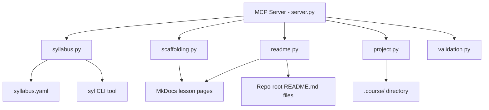
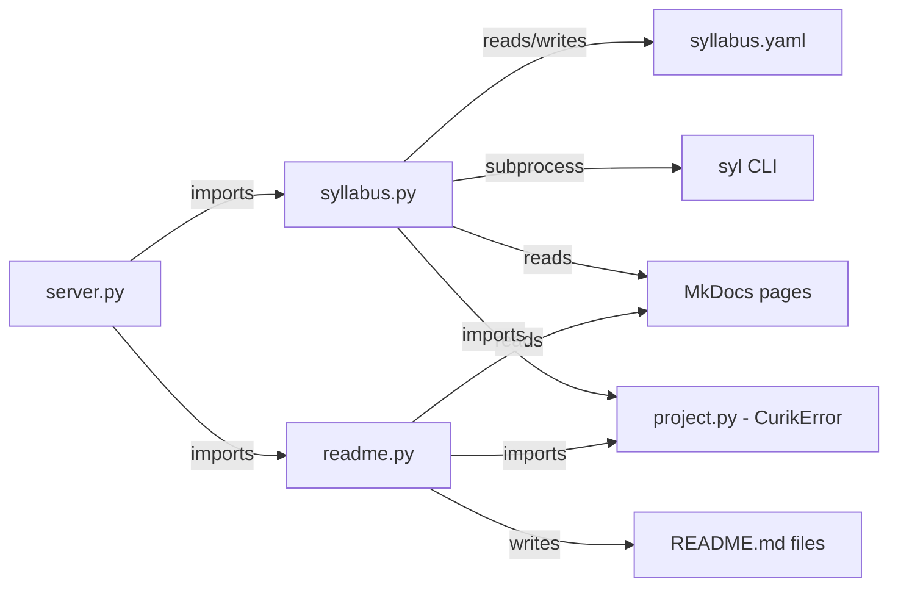

<!-- CLASI: Before changing code or making plans, review the SE process in CLAUDE.md -->

# Architecture

## Architecture Overview

Curik is a Python MCP server and CLI tool for curriculum development. It
manages course state through file-based artifacts in a `.course/` directory,
exposes process-enforcement tools via MCP, and provides agent/skill
definitions for specialized curriculum work.

This sprint adds two new modules (`syllabus.py` and `readme.py`) that
bridge the gap between the `syl` tool's syllabus.yaml and Curik's MkDocs
page management. The syllabus module provides read/write access to
syllabus.yaml entries, while the readme module extracts guarded content
from MkDocs pages to generate GitHub-visible README files.



## Technology Stack

- **Language:** Python >=3.10
- **YAML parsing:** PyYAML (already a transitive dependency via MkDocs)
- **Subprocess:** `subprocess.run` for invoking `syl compile`
- **Regex:** `re` module for comment guard parsing
- **MCP:** FastMCP from `mcp.server.fastmcp` (existing)
- **Testing:** unittest with `unittest.mock` for subprocess mocking

No new dependencies are introduced. PyYAML is available through the
existing MkDocs dependency chain.

## Component Design

### Component: Syllabus Module (`curik/syllabus.py`)

**Purpose**: Read and write lesson entries in syllabus.yaml, including
UID-based url field updates and subprocess invocation of `syl compile`.

**Boundary**: Inside -- YAML parsing, entry lookup by UID, url field
writing, `syl compile` subprocess invocation. Outside -- syllabus.yaml
schema definition (owned by `syl`), UID generation (owned by Sprint 009),
MkDocs page creation (owned by `scaffolding.py`).

**Use Cases**: SUC-001, SUC-003

Key functions:

- `read_syllabus_entries(root: Path) -> list[dict]` -- Parses syllabus.yaml
  and returns a list of entry dicts with keys: uid, path, title, url.
  Handles nested module/lesson structure. Returns an empty list if
  syllabus.yaml does not exist.

- `write_syllabus_url(root: Path, uid: str, url: str) -> dict` -- Finds the
  entry with the given UID in syllabus.yaml and sets its url field. Raises
  `CurikError` if the UID is not found. Returns the updated entry. Uses
  PyYAML to load, modify, and dump the file, preserving structure.

- `get_syllabus(root: Path) -> str` -- Returns the raw content of
  syllabus.yaml as a string.

- `regenerate_syllabus(root: Path) -> dict` -- Runs `syl compile` in the
  project root directory. Returns `{"success": true}` or
  `{"success": false, "error": "..."}` with stderr content.

- `validate_syllabus_consistency(root: Path) -> dict` -- Cross-references
  syllabus.yaml entries against MkDocs page frontmatter. Returns a report
  dict with keys: orphaned_entries, orphaned_pages, uid_mismatches,
  missing_urls, is_consistent.

### Component: README Module (`curik/readme.py`)

**Purpose**: Parse comment guards from MkDocs Markdown pages and generate
README.md files for repo-root lesson directories.

**Boundary**: Inside -- comment guard regex parsing, content extraction,
README assembly and file writing. Outside -- MkDocs page authoring (agents
write content), comment guard placement decisions (governed by
`readme-guards` skill), repo-root directory structure (created by
scaffolding).

**Use Cases**: SUC-002

Key functions:

- `parse_readme_guards(content: str) -> list[dict]` -- Extracts guarded
  sections from Markdown content. Returns a list of dicts with keys: type
  ("shared" or "only"), content (the text between opening and closing
  guards). Handles nested Markdown including code blocks that might contain
  HTML comments.

- `generate_readme(sections: list[dict]) -> str` -- Assembles a README.md
  string from parsed guard sections, concatenating content in order with
  appropriate spacing.

- `trigger_readme_generation(root: Path, scope: str) -> dict` -- Processes
  MkDocs pages at the given scope (a single page path, a module directory,
  or "all" for course-wide). For each page with guards, generates a
  README.md in the corresponding repo-root lesson directory. Returns
  `{"generated": [...], "skipped": [...]}` listing paths.

- `resolve_readme_path(root: Path, mkdocs_page: Path) -> Path` -- Maps an
  MkDocs page path (e.g., `docs/01-intro/01-hello.md`) to the corresponding
  repo-root lesson directory (e.g., `01-intro/01-hello/README.md`). The
  mapping logic uses the module and lesson names from the MkDocs path.

### Component: MCP Server Extensions (`curik/server.py`)

**Purpose**: Expose syllabus and README functions as MCP tools accessible
to agents.

**Boundary**: Inside -- tool registration, JSON serialization, error
handling wrappers. Outside -- business logic (delegated to syllabus.py
and readme.py).

**Use Cases**: SUC-001, SUC-002, SUC-003

Six new tool functions added to server.py:

- `tool_read_syllabus_entries()` -- wraps `read_syllabus_entries`
- `tool_write_syllabus_url(uid: str, url: str)` -- wraps `write_syllabus_url`
- `tool_regenerate_syllabus()` -- wraps `regenerate_syllabus`
- `tool_get_syllabus()` -- wraps `get_syllabus`
- `tool_trigger_readme_generation(scope: str)` -- wraps
  `trigger_readme_generation`
- `tool_validate_syllabus_consistency()` -- wraps
  `validate_syllabus_consistency`

All tools follow the existing pattern: `@mcp.tool()` decorator, try/except
`CurikError`, JSON serialization of return values.

### Component: README Guards Skill (`curik/skills/readme-guards.md`)

**Purpose**: Teach agents when and how to place `<!-- readme-shared -->`
and `<!-- readme-only -->` comment guards in MkDocs lesson pages.

**Boundary**: Inside -- guard syntax, placement guidelines, examples.
Outside -- actual content authoring decisions (agent responsibility).

**Use Cases**: SUC-002

The skill definition covers:
- Guard syntax: `<!-- readme-shared -->...<!-- /readme-shared -->` for
  content shared between MkDocs and README, `<!-- readme-only -->...
  <!-- /readme-only -->` for README-exclusive content.
- When to use shared guards: lesson introductions, learning objectives,
  setup instructions, exercise descriptions.
- When to use only guards: "view the full lesson" links, GitHub-specific
  navigation, Codespaces launch buttons.
- When not to guard: instructor guide sections, detailed explanations that
  only belong on the MkDocs site, quiz references.

## Dependency Map



- `server.py` -> `syllabus.py`: imports syllabus functions for MCP tool wrappers
- `server.py` -> `readme.py`: imports readme functions for MCP tool wrappers
- `syllabus.py` -> `project.py`: imports `CurikError` for error handling
- `readme.py` -> `project.py`: imports `CurikError` for error handling
- `syllabus.py` -> `syl` CLI: subprocess dependency for `regenerate_syllabus`
- `syllabus.py` -> Sprint 009 UID system: assumes UIDs are present in
  syllabus.yaml entries and page frontmatter

## Data Model

### syllabus.yaml Entry Structure

The `syl` tool produces syllabus.yaml with a nested structure. Each lesson
entry contains:

```yaml
- uid: "abc123"
  path: "01-intro/01-hello"
  title: "Hello World"
  url: "https://example.github.io/course/01-intro/01-hello/"
```

Curik reads the full structure and writes only the `url` field per entry.

### Comment Guard Format

```markdown
<!-- readme-shared -->
This content appears in both the MkDocs page and the README.
<!-- /readme-shared -->

<!-- readme-only -->
This content appears only in the README.
<!-- /readme-only -->
```

Guards are line-based: the opening comment must be on its own line, and the
closing comment must be on its own line. Content between them is extracted
verbatim.

### Consistency Report Structure

```json
{
  "orphaned_entries": [{"uid": "...", "path": "..."}],
  "orphaned_pages": [{"uid": "...", "file": "..."}],
  "uid_mismatches": [{"path": "...", "syllabus_uid": "...", "page_uid": "..."}],
  "missing_urls": [{"uid": "...", "path": "..."}],
  "is_consistent": false
}
```

## Security Considerations

- `regenerate_syllabus` invokes `syl compile` as a subprocess. The command
  is hardcoded (not user-supplied) and runs in the project root directory.
  No shell injection risk since no user input is interpolated into the
  command string. `subprocess.run` is called with `shell=False`.
- syllabus.yaml is read and written within the project root only. Path
  traversal is prevented by resolving the root path and checking that
  syllabus.yaml is within it.
- README.md files are written only to directories within the project root.
  The `resolve_readme_path` function validates that the output path does
  not escape the project boundary.

## Design Rationale

**Why comment guards instead of frontmatter flags or separate README source files?**
Comment guards keep README content co-located with the MkDocs lesson content.
Authors see exactly what will go into the README while editing the lesson.
Separate source files would require maintaining two files per lesson and
inevitably drift. Frontmatter flags could only control whole-file inclusion,
not section-level selection. HTML comments are invisible in MkDocs rendered
output, so they have zero impact on the student-facing site.

**Why UID-based lookup instead of path-based for syllabus writes?**
Paths can change when lessons are renamed or restructured. UIDs are stable
identifiers assigned once (by Sprint 009) and persist across restructuring.
This makes `write_syllabus_url` resilient to directory reorganization.

**Why subprocess for `syl compile` instead of importing syl as a library?**
The `syl` tool is a separate project with its own CLI. It is not designed
to be imported as a Python library. Subprocess invocation is the intended
integration point and matches how `syl` is used in CI/CD pipelines and
Makefiles.

## Open Questions

None. The syllabus.yaml format is well-established by the `syl` tool, the
UID system is defined by Sprint 009, and the comment guard syntax is a
straightforward extension of HTML comment conventions.

## Sprint Changes

Changes planned for this sprint:

### Changed Components

**Added: `curik/syllabus.py`**
New module providing YAML read/write for syllabus.yaml, entry parsing with
UID/path/title/url extraction, url field updates by UID, subprocess
invocation of `syl compile`, and consistency validation against MkDocs
page frontmatter.

**Added: `curik/readme.py`**
New module providing comment guard regex parsing for `<!-- readme-shared -->`
and `<!-- readme-only -->` markers, README content assembly from extracted
sections, and file writing to repo-root lesson directories.

**Modified: `curik/server.py`**
Six new MCP tool functions: `tool_read_syllabus_entries`,
`tool_write_syllabus_url`, `tool_regenerate_syllabus`, `tool_get_syllabus`,
`tool_trigger_readme_generation`, `tool_validate_syllabus_consistency`.
New imports from `curik.syllabus` and `curik.readme`.

**Added: `curik/skills/readme-guards.md`**
Skill definition teaching agents guard syntax, placement guidelines, and
examples for both shared and only guard types.

**Added: `tests/test_syllabus.py`**
Unit tests for syllabus entry parsing, url writing, subprocess mocking,
and consistency validation.

**Added: `tests/test_readme.py`**
Unit tests for comment guard parsing, README generation, path resolution,
and edge cases.

### Migration Concerns

None. This sprint adds new modules and tools without modifying existing
functionality. No data migration is needed. The new tools are additive
to the MCP server and do not change the behavior of existing tools.
