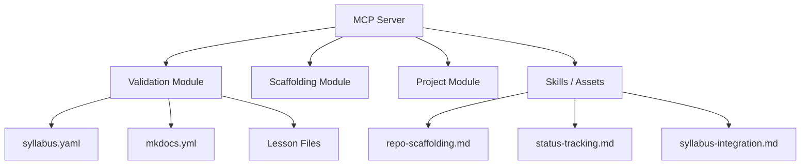
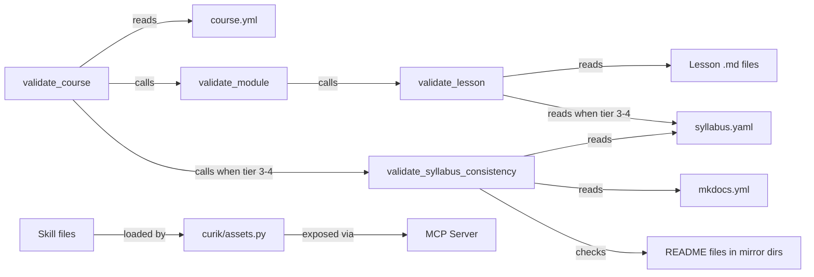

<!-- CLASI: Before changing code or making plans, review the SE process in CLAUDE.md -->

# Architecture

## Architecture Overview

Curik is a Python package that provides an MCP server and CLI for managing
curriculum development projects. The system has three main layers:

1. **Core library** (`curik/`): Pure-Python modules for project management,
   scaffolding, validation, quiz generation, research, and change tracking.
2. **MCP server** (`curik/server.py`): Thin wrapper exposing core functions
   as MCP tools for AI agents.
3. **Skill definitions** (`curik/skills/`): Static Markdown documents that
   give agents procedural knowledge about workflows and conventions.

## Technology Stack

- **Language**: Python 3.10+ (project standard)
- **MCP framework**: `mcp` package with `FastMCP` server
- **YAML parsing**: PyYAML (already a dependency for `course.yml` reading)
- **Testing**: pytest with `tmp_path` fixtures for filesystem isolation
- **Skill format**: Markdown with YAML frontmatter (loaded by
  `curik/assets.py`)

No new dependencies are introduced. PyYAML is used for parsing
`syllabus.yaml` and `mkdocs.yml`; it is already available in the project
environment.

## Component Design

### Component: Validation Module (`curik/validation.py`)

**Purpose**: Check structural correctness of lessons, modules, and courses.

**Boundary**: Reads lesson files, `course.yml`, `syllabus.yaml`, and
`mkdocs.yml`. Does not modify any files. Returns result dictionaries with
`valid` boolean and `errors` list.

**Use Cases**: SUC-001, SUC-002

This sprint adds tier-awareness to two existing functions:

- `validate_lesson(root, lesson_path, tier=None)` gains an optional `tier`
  parameter. When tier is 3 or 4, the function additionally:
  - Scans the lesson content for `<!-- readme-shared -->` comment guards.
  - Checks that the lesson's UID (derived from the filename stem) appears
    in `syllabus.yaml` at the course root.

- `validate_course(root)` reads the `tier` field from `course.yml`. When
  tier is 3 or 4, it additionally:
  - Calls `validate_syllabus_consistency(root)` to cross-reference
    `syllabus.yaml` entries against `mkdocs.yml` nav pages.
  - Checks that README files exist in repo-root mirror directories for
    each module.

A new helper `validate_syllabus_consistency(root)` encapsulates the
syllabus/nav comparison logic.

### Component: Skill Definitions (`curik/skills/`)

**Purpose**: Provide agents with structured procedural knowledge about
infrastructure conventions.

**Boundary**: Static Markdown files read by `curik/assets.py`. No runtime
logic. Content is authoritative documentation, not executable code.

**Use Cases**: SUC-003

Three new files:

- `repo-scaffolding.md`: Documents the expected directory structure for
  each tier and course type, stub file templates, mkdocs.yml generation
  rules, and .devcontainer configuration.
- `status-tracking.md`: Documents the `.curik/` directory layout, issue
  and change plan file formats, YAML frontmatter fields, and state
  transition rules.
- `syllabus-integration.md`: Documents how Curik reads syllabus.yaml
  entries, writes `url` fields back, triggers `syl compile`, and
  coordinates with README generation.

## Dependency Map

Key dependency: `validate_syllabus_consistency` depends on Sprint 010
delivering `syllabus.yaml` parsing utilities. If those are not yet
available, the function will use PyYAML directly to parse the file.

## Data Model

No new persistent data structures. The validation functions read existing
files:

- **syllabus.yaml**: YAML file with a list of entries, each having at
  minimum a `uid` field and a `path` field pointing to the lesson file.
- **mkdocs.yml**: Standard MkDocs configuration with a `nav` key listing
  page paths.
- **course.yml**: Existing project metadata file; this sprint reads the
  `tier` field (integer 1-4).
- **Lesson files**: Markdown files that may contain `<!-- readme-shared -->`
  HTML comment guards.

## Security Considerations

No security implications. All operations are local file reads on the
developer's machine. No network access, no credential handling, no user
input beyond file paths.

## Design Rationale

**Explicit tier parameter on `validate_lesson` rather than reading
`course.yml` internally.**
Alternative: Have `validate_lesson` read `course.yml` to determine the
tier automatically.
Decision: Keep the function signature explicit. `validate_lesson` operates
on a single file and should not need to locate and parse `course.yml`.
The caller (`validate_course` or the MCP tool) already knows the tier and
passes it in. This keeps the function testable in isolation without
requiring a full course directory structure.

**Comment guard check uses string search, not AST parsing.**
Alternative: Parse the Markdown into an AST and look for HTML comment
nodes.
Decision: A simple `in` check or `re.search` for `<!-- readme-shared -->`
is sufficient. The guard is a fixed string, not a pattern. String search
is faster, simpler, and has no additional dependencies.

**Syllabus consistency as a separate helper function.**
Alternative: Inline the logic in `validate_course`.
Decision: Extract to `validate_syllabus_consistency` for testability and
clarity. The syllabus/nav comparison is a self-contained concern that
benefits from its own unit tests.

**Skill definitions as static Markdown rather than code.**
Alternative: Encode conventions in Python functions or JSON schemas.
Decision: Markdown skill files match the existing pattern in
`curik/skills/`. They are human-readable, version-controlled, and loaded
by the existing `get_skill_definition` mechanism. No new infrastructure
needed.

## Open Questions

None. The sprint scope is well-defined and all dependencies are identified.

## Sprint Changes

Changes planned for this sprint.

### Changed Components

**Modified: `curik/validation.py`**
- `validate_lesson()`: Add optional `tier` parameter. When tier is 3 or 4,
  check for `<!-- readme-shared -->` comment guard and verify lesson UID
  in `syllabus.yaml`.
- `validate_course()`: Read tier from `course.yml`. When tier is 3 or 4,
  call `validate_syllabus_consistency()` and check README existence in
  mirror directories.
- New function: `validate_syllabus_consistency(root)` — parse
  `syllabus.yaml` and `mkdocs.yml`, report entries present in one but not
  the other.

**Added: `curik/skills/repo-scaffolding.md`**
- Documents directory structure conventions by tier (1-2 vs 3-4) and by
  course type (course vs resource-collection).
- Documents stub file templates for lessons and modules.
- Documents mkdocs.yml generation rules.
- Documents .devcontainer configuration expectations.

**Added: `curik/skills/status-tracking.md`**
- Documents the `.curik/` directory structure: `state.json`, `spec.md`,
  `outlines/`, `change-plan/active/`, `change-plan/done/`, `issues/open/`,
  `issues/done/`.
- Documents issue file format (YAML frontmatter + Markdown body).
- Documents change plan file format and state transitions (active -> done).
- Documents `state.json` fields and valid values.

**Added: `curik/skills/syllabus-integration.md`**
- Documents how Curik reads `syllabus.yaml` to enumerate course entries.
- Documents writing the `url` field back after README generation.
- Documents triggering `syl compile` to regenerate the syllabus site.
- Documents coordination between syllabus updates and README generation.

**Added: `tests/test_validation_enhanced.py`**
- Tests for comment guard validation at tiers 1-4 and None.
- Tests for syllabus UID presence checks.
- Tests for syllabus/nav consistency validation.
- Tests for README existence checks in mirror directories.
- Tests for skill file loading via `get_skill_definition`.
- Backward compatibility tests confirming no regressions.

### Migration Concerns

None. The `tier` parameter defaults to `None`, so all existing callers of
`validate_lesson()` continue to work without modification. The
`validate_course()` changes only activate when `course.yml` contains
`tier: 3` or `tier: 4`, so existing Tier 1-2 courses are unaffected. The
three new skill files are additive and do not modify existing skills.
